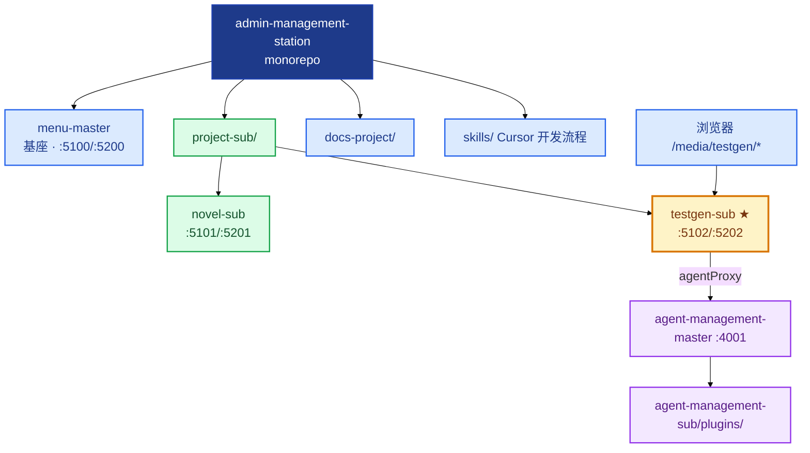
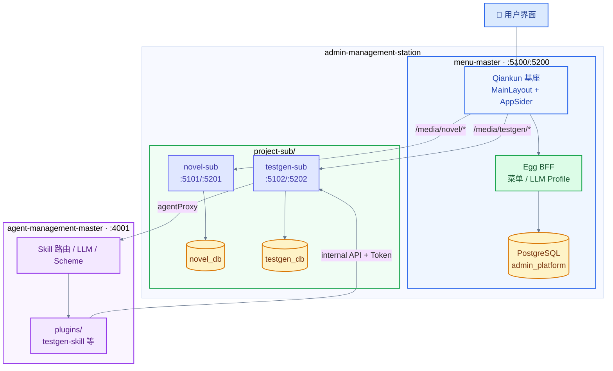
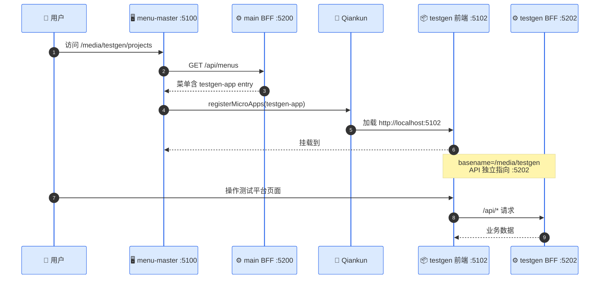
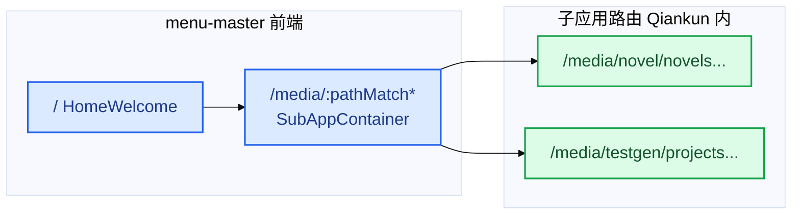
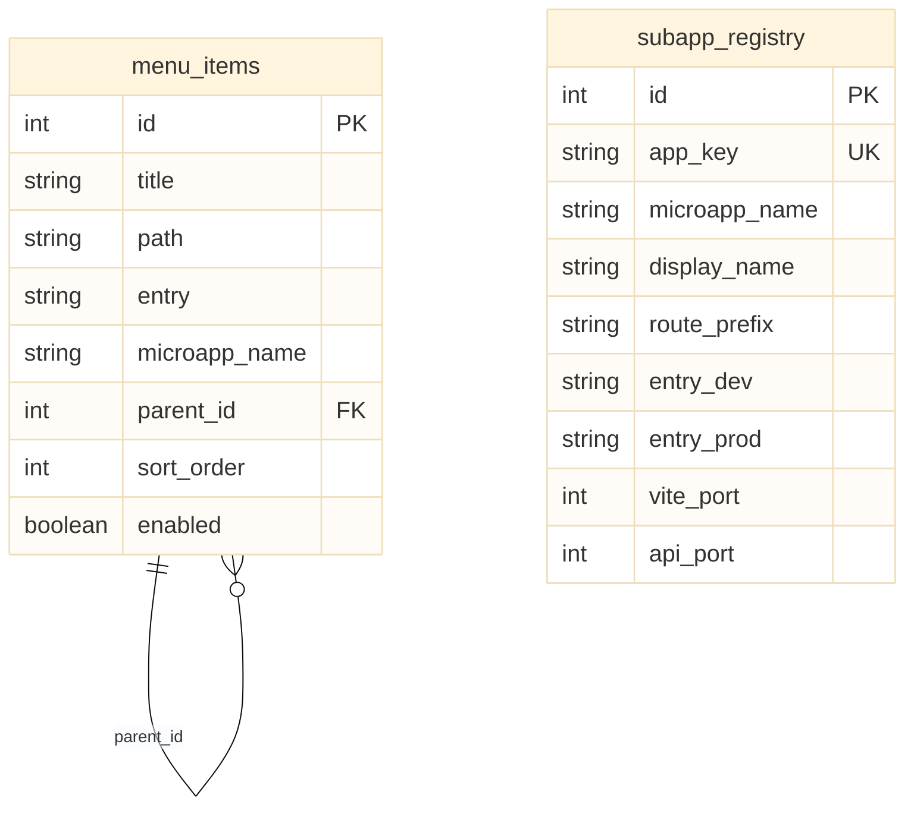
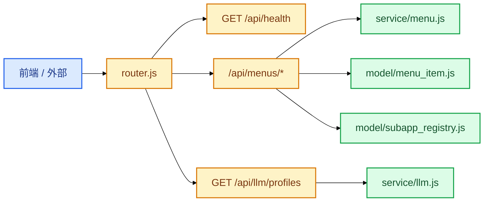
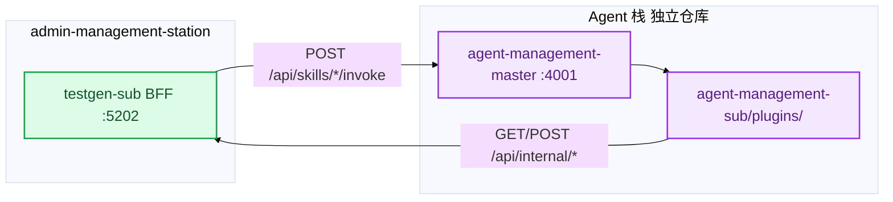
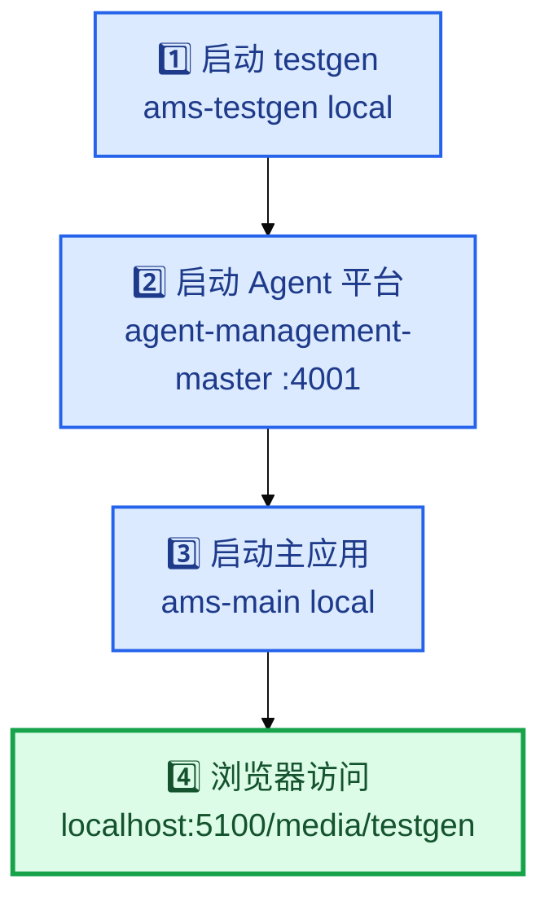

# admin-management-station 平台架构与关系图

> 更新：2026-07-02  
> 范围：主应用 `menu-master`、子应用聚合 `project-sub/`、外部 Agent 平台协作关系  
> 测试平台评分 → [项目评分与后续计划.md](../project-sub/testgen-sub/docs/项目评分与后续计划.md)

**图例**：■ 前端/浏览器 · ■ BFF 服务 · ■ 数据库 · ■ Agent · ■ 子应用

---

## 1. 两项目关系总览

`admin-management-station`（AMS）是**私人管理平台 monorepo**，采用 Qiankun 微前端架构。`testgen-sub` 不是独立仓库，而是内嵌于 `project-sub/testgen-sub/` 的自包含子应用。

| 维度 | admin-management-station | testgen-sub |
|------|------------------------|-------------|
| 定位 | 多应用聚合基座 | AI 测试平台业务子应用 |
| 物理关系 | 父仓库 | `project-sub/testgen-sub/` 子目录 |
| 前端端口 | 5100（基座） | 5102（独立 Vite） |
| BFF 端口 | 5200 | 5202 |
| 数据库 | `admin_platform` | `testgen_db` |
| 注册方式 | 扫描 `subapp.manifest.json` | 提供 manifest，由主应用 sync |
| Agent 能力 | 不内嵌 | 通过 BFF `agentProxy` 调外部平台 |

---

## 2. 系统架构交互图

---

## 3. 微前端加载流程

**关键配置文件**

| 文件 | 作用 |
|------|------|
| `project-sub/testgen-sub/subapp.manifest.json` | 子应用注册元数据 |
| `menu-master/deploy/scripts/sync-subapps.mjs` | 启动时扫描 manifest 写入主库 |
| `menu-master/frontend/src/qiankun/config.js` | entry 映射 `testgen-app` |
| `testgen-sub/frontend/src/services/apiConfig.js` | 嵌入时 API 绝对 URL → 5202 |

---

## 4. 主应用前端页面与路由

| 路由 | 组件 | 说明 |
|------|------|------|
| `/` | `HomeWelcome.vue` | 欢迎页 |
| `/media/:pathMatch(.*)*` | `SubAppContainer.vue` | Qiankun 子应用挂载点 |

**布局组件**：`MainLayout.vue` · `AppSider.vue` · `LlmProfileSelector.vue`

---

## 5. 主应用数据库表

| 表 | 用途 |
|----|------|
| `menu_items` | 树形侧栏菜单；子应用 sync 后自动写入一级入口 |
| `subapp_registry` | 子应用 entry、端口、路由前缀等注册信息 |

---

## 6. 主应用 API 结构

| API | 鉴权 | 说明 |
|-----|------|------|
| `GET /api/menus` | 公开 | 侧栏菜单树 |
| `POST/PUT/DELETE /api/menus` | admin JWT | 菜单 CRUD |
| `GET /api/llm/profiles` | 公开 | LLM 配置列表 |

---

## 7. 子应用对比

| 应用 | CLI | 前端 | BFF | PG | 业务域 |
|------|-----|:----:|:----:|-----|--------|
| novel-sub | `ams-novel` | 5101 | 5201 | 5301 / novel_db | 小说 CRUD |
| testgen-sub | `ams-testgen` | 5102 | 5202 | 5302 / testgen_db | 用例生成 + Fitness |

**自包含原则**：各应用自带 `deploy/docker-compose.yml`、独立 Postgres、独立 BFF；**不共享** frontend/backend 源码包。

---

## 8. 与 Agent 平台的三方协作

| 仓库 | 职责 |
|------|------|
| `admin-management-station` | UI + BFF + 业务 DB + 执行引擎 |
| `agent-management-master` | Skill 路由、LLM、Scheme 执行 |
| `agent-management-sub` | Skill 插件源码（testgen-skill 等） |

---

## 9. 开发 Skills（Cursor 流程，非运行时 Agent）

| Skill | 路径 | 用途 |
|-------|------|------|
| `main-app-developer` | `skills/main-app-developer/` | 主应用基座开发 |
| `sub-app-developer` | `skills/sub-app-developer/` | 子应用脚手架与 Qiankun 接入 |
| `novel-sub-developer` | `skills/project-developer/novel-sub/` | 小说子应用业务迭代 |
| `testgen-sub-developer` | `skills/project-developer/testgen-sub/` | 测试平台业务迭代 |

---

## 10. 启动与联调顺序

**端口注册表**：[`应用端口与命名注册表.md`](./应用端口与命名注册表.md)

---

## 11. 相关文档索引

| 文档 | 路径 |
|------|------|
| 仓库说明 | `README.md` |
| 主应用设计 | `docs-project/私人管理平台主应用设计.md` |
| 测试平台架构 | `project-sub/testgen-sub/docs/测试平台架构关系图.md` |
| **测试平台评分与计划** | `project-sub/testgen-sub/docs/项目评分与后续计划.md` |
| **测试平台文档索引** | `project-sub/testgen-sub/docs/README.md` |
| Agent Skill 说明 | `../agent-management-sub/README.md` |
| Agent 联调 | `project-sub/testgen-sub/docs/设计-Agent联调配置.md` |
