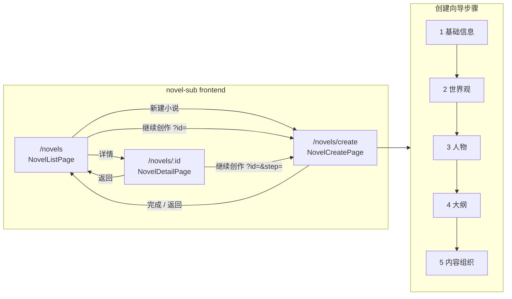
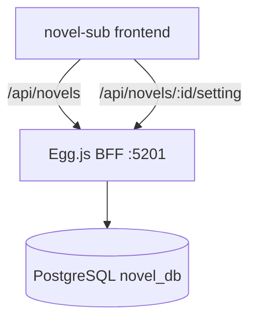

# novel-sub 架构关系图

> 子应用 `app_key=novel` · BFF `:5201` · Vite `:5101`

## 前端路由



| 路由 name | 路径 | 组件 | 说明 |
|-----------|------|------|------|
| `novel-list` | `/novels` | `NovelListPage.vue` | 看板 + 表格 |
| `novel-create` | `/novels/create` | `NovelCreatePage.vue` | 五步向导；Query：`?id=`、`?step=1..5` |
| `novel-detail` | `/novels/:id` | `NovelDetailPage.vue` | 五模块只读详情；Query：`?tab=1..5` |

嵌入主应用时 basename 为 `/media/novel`（Qiankun props）。

## BFF API



| 方法 | 路径 | 用途 |
|------|------|------|
| GET | `/api/novels` | 列表（分页/筛选） |
| POST | `/api/novels` | 创建小说（步骤 1 草稿） |
| GET | `/api/novels/:id` | 详情 + `setting_json` |
| PUT | `/api/novels/:id` | 更新基础字段 |
| PUT | `/api/novels/:id/setting` | 合并写入 `setting_json` 分块 |
| DELETE | `/api/novels/:id` | 删除 |
| POST | `/api/novels/batch-delete` | 批量删除 |

### setting_json 结构

```json
{
  "world": { "era", "geography", "timeline": [] },
  "characters": [{ "id", "name", "role", "personality" }],
  "character_edges": [{ "id", "source", "target", "relation", "label" }],
  "outline": { "volumes": [{ "groups": [{ "sections": [] }] }] },
  "chapters": [{ "id", "title", "faction", "order" }]
}
```

## 关键前端模块

| 模块 | 路径 |
|------|------|
| 向导状态 | `composables/useNovelCreateWizard.js` |
| 详情状态 | `composables/useNovelDetail.js` |
| Schema / 校验 | `utils/novelCreateSchema.js` |
| 详情展示辅助 | `utils/novelDetail.js` |
| API | `services/novelService.js` |
| 魔幻森林主题 | `styles/variables.css` 等 |
| 创建 UI | `components/novel/create/*` |
| 详情 UI | `components/novel/detail/*` |
| 人物关系图 | `components/novel/create/CharacterRelationGraph.vue`（AntV G6，详情页 `readonly`） |

## 联调拓扑

```text
浏览器 :5100 (menu-master)
  └─ Qiankun → novel-sub :5101（或 /subapps/novel-app/ 经主应用 Vite 代理）
       └─ API → http://localhost:5201/api
```
