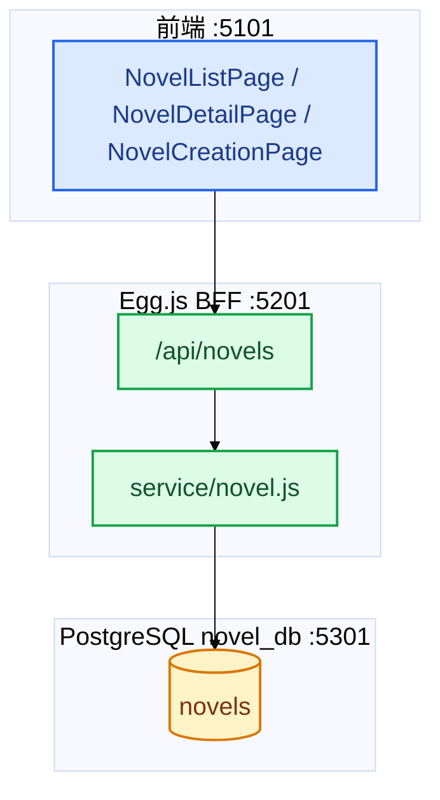
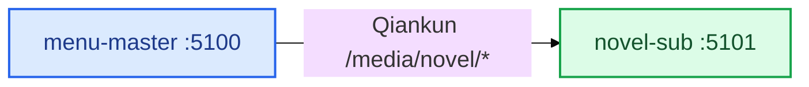
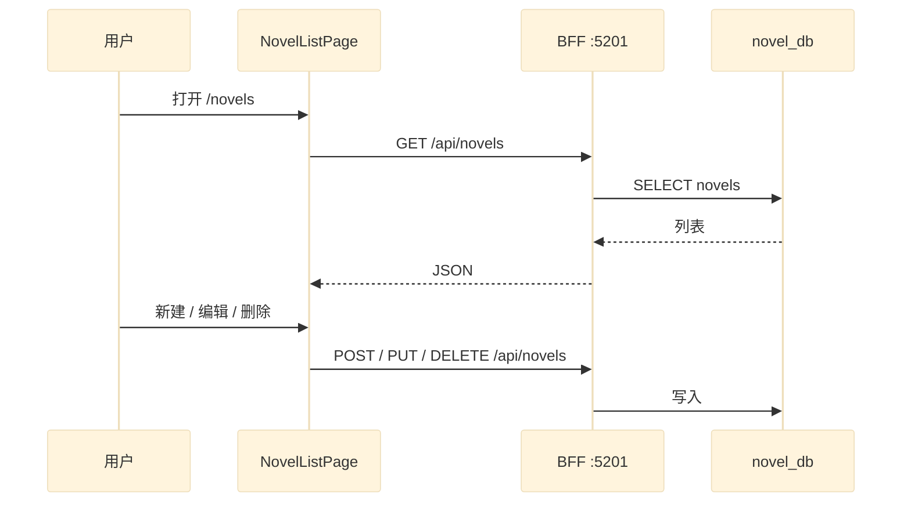

# novel-sub 架构与流程图

> 更新：2026-07-02  
> 评分与待办 → [项目评分与后续计划.md](./项目评分与后续计划.md)

---

## 1. 系统架构

---

## 2. 与主应用关系

---

## 3. 核心业务流程

---

## 4. 数据库

| 表 | 说明 |
|----|------|
| `novels` | 小说主表 |

---

## 5. 相关文档

| 文档 | 路径 |
|------|------|
| 变更记录 | [变更记录.md](./变更记录.md) |
| 评分与计划 | [项目评分与后续计划.md](./项目评分与后续计划.md) |
| AMS 平台 | [../../docs-project/AMS平台架构关系图.md](../../docs-project/AMS平台架构关系图.md) |
