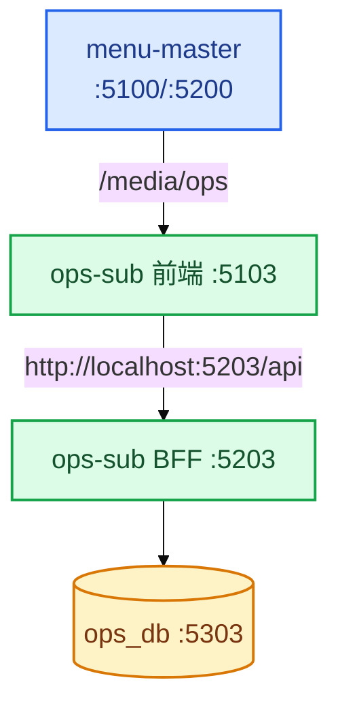
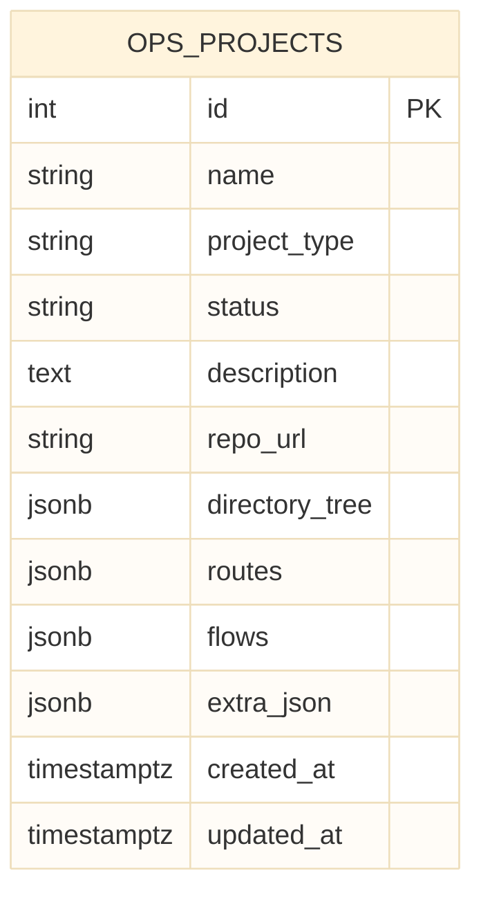
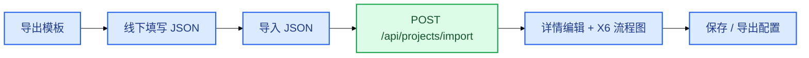

# 运维管理平台架构关系图

> 子应用 `app_key=ops` · BFF `:5203` · Vite `:5103` · PG `:5303` / `ops_db`  
> 本期不接入 Agent 平台。

**图例**：■ 前端 · ■ BFF · ■ 数据库 · ■ 主应用

---

## 1. 在 AMS 中的位置

## 2. 前端导航

| 路由名 | 路径 | 页面 |
|--------|------|------|
| `ops-list` | `/projects` | 列表：筛选、看板/表格、导出模板、导入、导出配置 |
| `ops-detail` | `/projects/:id` | 详情 Tab：基础信息 / 目录 / 路由 / 功能流程图 |

嵌入主应用 basename = `/media/ops`。独立 dev 同样使用该 basename，便于与 Qiankun 路径一致。

## 3. API 域

| 方法 | 路径 | Controller |
|------|------|------------|
| GET | `/api/health` | health.index |
| GET | `/api/projects` | project.index |
| GET | `/api/projects/template` | project.template |
| POST | `/api/projects/import` | project.importFile |
| GET | `/api/projects/:id/export` | project.exportFile |
| POST | `/api/projects` | project.create |
| GET | `/api/projects/:id` | project.show |
| PUT | `/api/projects/:id` | project.update |
| DELETE | `/api/projects/:id` | project.destroy |

响应信封：`{ code: 0, message, data }`。

## 4. 数据库

目录树、路由、流程图均存 JSONB，与导出模板字段一一对应。

## 5. 核心用户流

## 6. 分层

| 层 | 职责 |
|----|------|
| 前端 | Vue 3 + Element Plus + AntV X6；森林风令牌挂在 `.ops-sub-root` |
| BFF | Egg.js + Sequelize；启动 `schemaSync` |
| DB | 独立 `ops_db` |
| Agent | 未接入（部署黑窗口后续再接 `agent-management-master`） |
