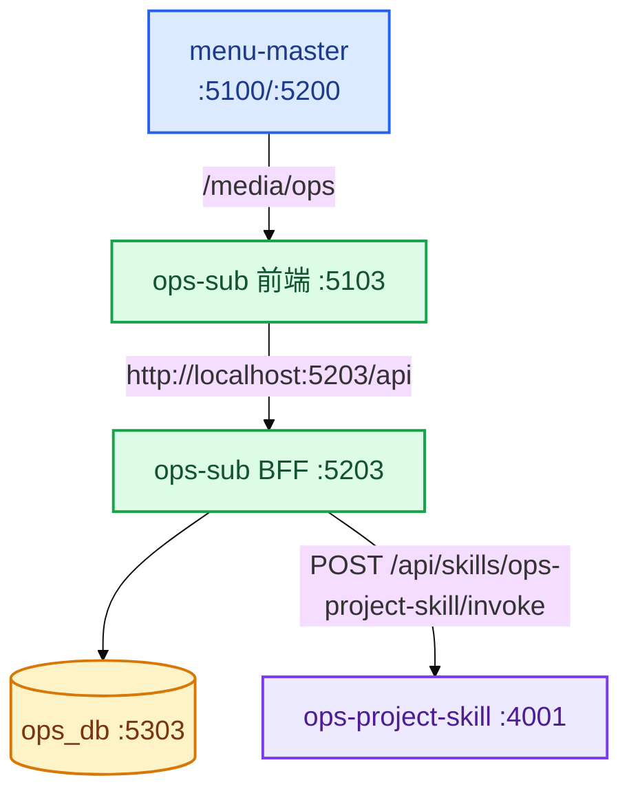
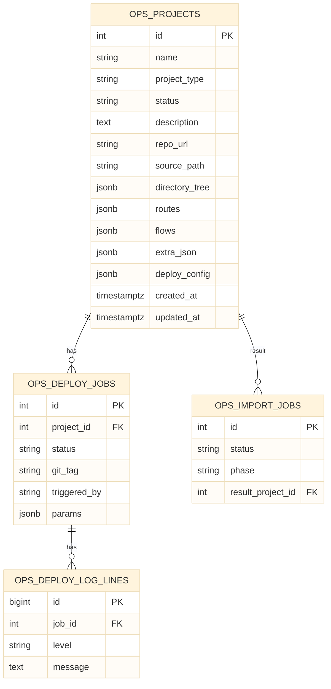

# 运维管理平台架构关系图

> 子应用 `app_key=ops` · BFF `:5203` · Vite `:5103` · PG `:5303` / `ops_db`  
> 配置生成接 Agent：`ops-project-skill`（`agent-management-master/plugins/ops-project-skill/`）

**图例**：■ 前端 · ■ BFF · ■ 数据库 · ■ 主应用

---

## 1. 在 AMS 中的位置

Skill 源码位置（持续优化只改这里）：`agent-management-master/plugins/ops-project-skill/`（当前 1.3.0）。

身份与权限只在 **menu-master**：`/login` `/register` `/users` `/audit` `/settings`。ops-sub 只验 JWT，不建用户表。角色 `admin` / `operator`。

## 2. 前端导航

| 路由名 | 路径 | 页面 |
|--------|------|------|
| `ops-list` | `/projects` | 项目信息列表：筛选、看板/表格、导出模板、导入、新建 |
| `ops-deploy-jobs` | `/deploy-jobs` | 跨项目部署任务总览（侧栏第二项） |
| `ops-create` | `/projects/new` | 新建：基础信息 + 生成配置 + 导入项目库 |
| `ops-detail` | `/projects/:id` | 详情只读：基础信息 / 目录 / 路由 / 功能流程 |
| `ops-edit` | `/projects/:id/edit` | 编辑：可改、可重新生成配置 |
| `ops-deploy` | `/projects/:id/deploy` | 部署操作：选 tag、填参数 |
| `ops-deploy-log` | `/projects/:id/deploy/:jobId` | 部署黑窗口（SSE） |
| `ops-deploy-history` | `/projects/:id/deploy-logs` | 该项目部署历史 |

嵌入主应用 basename = `/media/ops`。独立 dev 同样使用该 basename，便于与 Qiankun 路径一致。

侧栏：「项目信息」「部署任务」。项目内部署三页从列表 / 详情进入。

## 3. API 域

| 方法 | 路径 | Controller |
|------|------|------------|
| GET | `/api/health` | health.index |
| GET | `/api/projects` | project.index |
| GET | `/api/projects/template` | project.template |
| POST | `/api/projects/import` | project.importFile |
| POST | `/api/projects/import-jobs` | project.createImportJob |
| GET | `/api/projects/import-jobs/:jobId` | project.showImportJob |
| GET | `/api/projects/import-jobs/:jobId/stream` | project.streamImport（SSE） |
| POST | `/api/projects/generate` | project.generate |
| POST | `/api/projects/:id/generate` | project.generateApply |
| GET | `/api/projects/:id/export` | project.exportFile |
| GET | `/api/projects/:id/git-tags` | deploy.gitTags |
| POST | `/api/projects/:id/deploy` | deploy.create |
| GET | `/api/projects/:id/deploy/jobs` | deploy.listByProject |
| GET | `/api/deploy/jobs` | deploy.listAll |
| GET | `/api/deploy/jobs/summary` | deploy.summary |
| GET | `/api/deploy/jobs/:jobId` | deploy.show |
| GET | `/api/deploy/jobs/:jobId/logs` | deploy.logs |
| GET | `/api/deploy/jobs/:jobId/logs.txt` | deploy.logsText |
| GET | `/api/deploy/jobs/:jobId/stream` | deploy.stream（SSE） |
| POST | `/api/deploy/jobs/:jobId/retry` | deploy.retry |
| POST | `/api/deploy/jobs/:jobId/abort` | deploy.abort |
| POST | `/api/projects` | project.create |
| GET | `/api/projects/:id` | project.show |
| PUT | `/api/projects/:id` | project.update |
| DELETE | `/api/projects/:id` | project.destroy |

响应信封：`{ code: 0, message, data }`。  
除 `GET /api/health`、`GET /api/projects/template` 外，项目接口需 `Authorization: Bearer`（与 menu-master 同一 `JWT_SECRET`）。本地可用 `OPS_AUTH_OPTIONAL=1` 暂不校验。

## 4. 数据库

目录树、路由、流程图均存 JSONB，与导出模板字段一一对应。部署任务在 `ops_deploy_jobs` / `ops_deploy_log_lines`。导入进度在 `ops_import_jobs`。

## 5. 核心用户流

```mermaid
%%{init: {'theme':'base', 'themeVariables': {'fontSize':'20px'}}}%%
flowchart LR
    classDef ui fill:#DBEAFE,stroke:#2563EB,stroke-width:2px,color:#1E3A8A
    classDef bff fill:#DCFCE7,stroke:#16A34A,stroke-width:2px,color:#14532D

    A["新建 / 填路径"]:::ui --> B["生成配置"]:::ui
    B --> C["POST /api/projects/generate"]:::bff
    C --> D["ops-project-skill"]:::bff
    D --> E["导入项目库"]:::ui
    E --> F["详情只读 / 编辑重生成"]:::ui
    F --> G["部署操作"]:::ui
    G --> H["POST /api/projects/:id/deploy"]:::bff
    H --> I["黑窗口 SSE"]:::ui
```

配置生成与部署执行分开：生成走 `ops-project-skill`。部署按项目 `deploy_config.product`：`generic` 仍是 HTTPS 拉 tag + 白名单构建；`agentrun` 写入 AK/环境后跑 `fitness-cli prod` 等价命令（可配 `agentrun.package_path`，GitHub 只拉该子目录）；`aliyun_ecs` / `tencent_cvm` 本期 mock。`ops-deploy-skill` 只定合同，不跑构建。

## 6. 分层

| 层 | 职责 |
|----|------|
| 前端 | Vue 3 + Element Plus + AntV X6；森林风令牌挂在 `.ops-sub-root` |
| BFF | Egg.js + Sequelize；启动 `schemaSync`；`agentProxy` 转发生成 |
| DB | 独立 `ops_db` |
| Agent | `agent-management-master/plugins/ops-project-skill/` 扫描路径并产出配置 |
