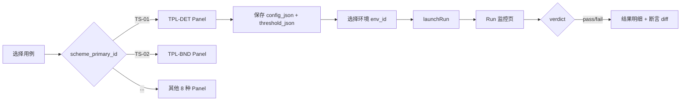
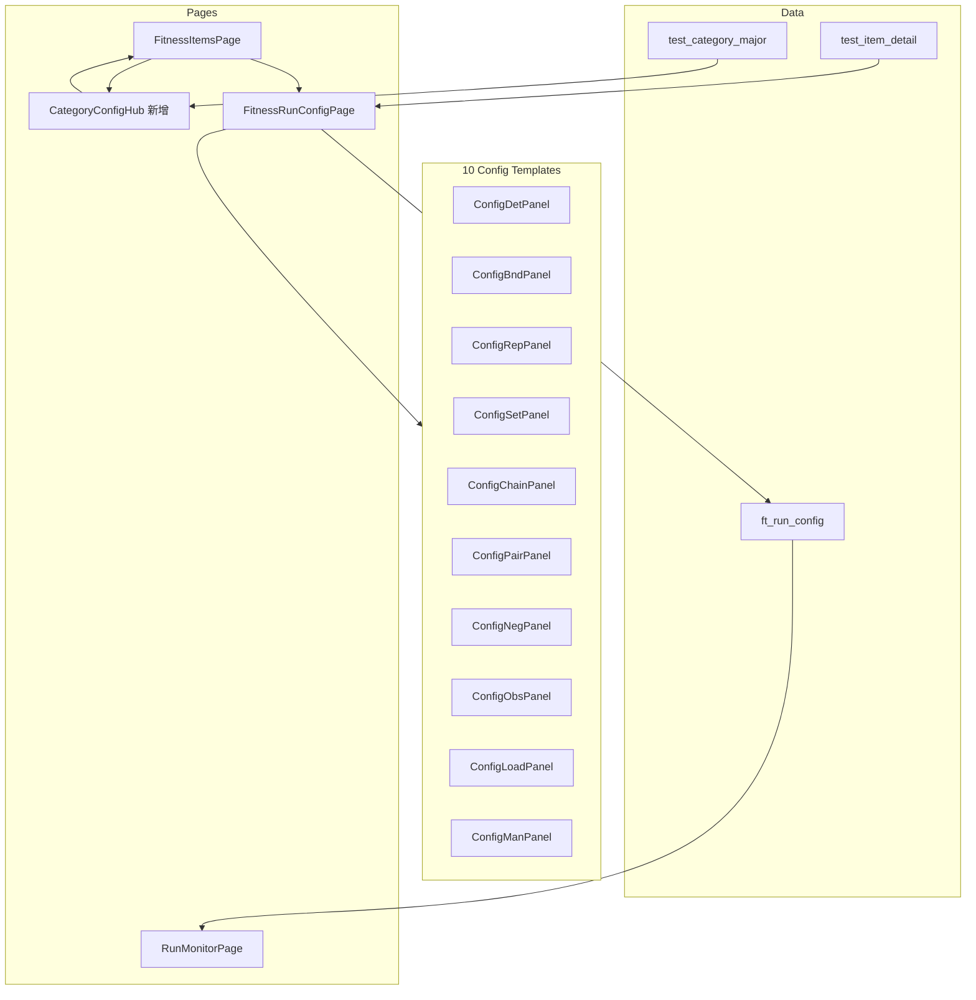

# 测试大类配置页面设计方案

> 基于 `test_category_major` 52 个大类，梳理配置模板归并关系，设计「填写配置 → 执行用例 → 反馈结果」的前端页面体系。  
> 项目：`fitness-agent` · 数据版本：2026-07

---

## 1. 设计目标

| 目标 | 说明 |
|------|------|
| **模板复用** | 52 个大类不各做一页，按测试方案 TS 归并为 **10 套配置模板** |
| **分类感知** | 同模板下按大类预填字段、展示业务提示、默认阈值 |
| **闭环执行** | 配置保存 → 选择环境 → 发起 Run → 展示 verdict / 明细 |
| **与现有代码对齐** | 复用 `FitnessRunConfigPage` + `Config*Panel.vue`，扩展大类元数据驱动 |

---

## 2. 分类总览（8 维度 · 52 大类）

```
维度 A 测试层级      A1–A6   (19 用例)   金字塔：单元→站级→HTTP→E2E→压测→UAT
维度 B 六站流水线    B1–B6 + B_REL (38)   async 主链 S01–S06 + 可靠性法则
维度 C 业务功能      C1–C4   (147)       三端业务 + 状态机 + 载荷矩阵
维度 D 接口与套壳    D1–D5   (28)        HTTP/SSE/套壳/JWT
维度 E Agent智能质量 E1–E6 + E_RISK + E_SKILL (40)  意图/工具/Eval/高风险
维度 F 非功能        F1–F6   (30)        性能/可靠性/部署/容量
维度 G 用户体验      G1–G8   (31)        阶段文案/排队/续传/结构化 UI
维度 H 可观测与排障  H1–H8   (46)        journey/日志/SLS/排障
```

**归并原则**：大类默认 TS/VS 来自 `data.json`；子类实际方案以 `test_category_minor_scheme` 为准（同一大类内可能存在多种 TS，以 item 级 `scheme_primary_id` 路由到具体 Panel）。

---

## 3. 十套配置模板（核心归并）

现有前端已实现 10 个 Panel，与 TS 一一对应：

| 模板 ID | TS 方案 | Panel 组件 | 验证组 | 核心 config_json | 核心 threshold_json |
|---------|---------|------------|--------|------------------|---------------------|
| **TPL-DET** | TS-01-DET 确定性单次 | `ConfigDetPanel` | DETERMINISTIC | path, method, body, expect_status | — |
| **TPL-BND** | TS-02-BND 边界矩阵 | `ConfigBndPanel` | DETERMINISTIC | matrix[] | — |
| **TPL-REP** | TS-03-REP 重复抽样 | `ConfigRepPanel` | STATISTICAL | repeat_count, runner, path/cli | passk_N, passk_M |
| **TPL-SET** | TS-04-SET 固定样本集 | `ConfigSetPanel` | STATISTICAL | sample_set_id | rate_L/M/H |
| **TPL-CHAIN** | TS-05-CHAIN 多步链路 | `ConfigChainPanel` | DETERMINISTIC | steps[] + extract | — |
| **TPL-PAIR** | TS-06-PAIR 对照对比 | `ConfigPairPanel` | DETERMINISTIC | pairs[] (role/path/forbidden) | — |
| **TPL-NEG** | TS-07-NEG 对抗专项 | `ConfigNegPanel` | STATISTICAL | cases[] (expect_blocked) | block_rate_min |
| **TPL-OBS** | TS-08-OBS 可观测稽核 | `ConfigObsPanel` | OBSERVABILITY | checks[] (http/journey) | require_complete |
| **TPL-LOAD** | TS-09-LOAD 压测容量 | `ConfigLoadPanel` | SLO | vu, duration_sec, path | p99_max_ms, error_rate_max |
| **TPL-MAN** | TS-10-MAN 人工评审 | `ConfigManPanel` | MANUAL | rubric_id, reviewer_count | — (VS-11 多数决) |

路由映射（已实现）：

```javascript
// fitnessService.js → SCHEME_CONFIG_ROUTES
TS-01-DET → /fitness/items/:itemId/config/det
TS-02-BND → .../config/bnd
// ... 共 10 种
```

---

## 4. 大类 → 模板映射表

### 4.1 一对一 / 主模板明确（可直接按大类默认 TS 跳转）

| 大类 | 名称 | 主模板 | 默认 VS | 用例数 | 备注 |
|------|------|--------|---------|--------|------|
| A1 | 单元/契约 | TPL-DET | VS-02-CONTRACT* | 7 | 子类偏契约；Panel 需支持 CLI runner |
| A2 | 站级集成 | TPL-DET | VS-01-EXACT | 6 | 站级 CLI 为主 |
| A3 | HTTP/服务 | TPL-DET | VS-01-EXACT | 0 | submit/stream/探针 |
| A4 | 全栈 E2E | **TPL-CHAIN** | VS-04-CHAIN-OK | 0 | 大类默认 TS 与 item 不一致，以 item 为准 |
| A5 | 压测/运维 | **TPL-LOAD** | VS-10-SLO-M | 3 | |
| A6 | Eval/UAT | **TPL-SET** + TPL-MAN(辅) | VS-07-RATE-M | 3 | 双方案：自动 Golden + 专家人工 |
| B1 | ① 前端 | TPL-DET | VS-01-EXACT | 5 | SSE/resume/queue_meta |
| B2 | ② 门禁 | TPL-DET | VS-01-EXACT | 10 | Key/熔断/限流 |
| B3 | ③ 队列 | TPL-DET | VS-01-EXACT | 8 | claim/cancel/retry |
| B4 | ④ Pipeline | **TPL-BND** | VS-02-CONTRACT | 5 | 状态机矩阵 |
| B5 | ⑤ Pi | TPL-DET | VS-02-CONTRACT | 4 | outbox 契约 |
| B6 | ⑥ 回传 | **TPL-CHAIN** | VS-04-CHAIN-OK | 6 | SSE/journey/TTFT 链路 |
| B_REL | 可靠性法则 | TPL-DET | VS-01-EXACT | 0 | 幂等/串行/可恢复 |
| D1 | 接口正常路径 | TPL-DET | VS-01-EXACT | 5 | |
| D2 | 接口异常/错误码 | TPL-DET | VS-01-EXACT | 9 | |
| D3 | 套壳联调 | TPL-DET | VS-01-EXACT | 5 | JWT/CORS |
| D4 | 202 载荷字段 | TPL-DET | VS-01-EXACT | 4 | schema 字段断言 |
| D5 | SSE 事件类型 | TPL-DET | VS-01-EXACT | 5 | 事件序列断言 |
| E1 | 决策与路径 | **TPL-SET** | VS-07-RATE-H | 5 | Golden 意图样本 |
| E5 | 安全与合规 | **TPL-NEG** | VS-09-BLOCK-H | 5 | 注入/医疗/隐私 |
| E6 | Eval/CI | **TPL-SET** | VS-07-RATE-H | 4 | Golden/Mock/Judge |
| E_RISK | Agent高风险清单 | **TPL-NEG** | VS-09-BLOCK-H | 10 | PRD §8 |
| E_SKILL | Skill路由 | **TPL-SET** | VS-07-RATE-H | 5 | skill 对照样本集 |
| E2 | 工具调用 | **TPL-REP** | VS-08-PASSK* | 4 | 子类 TS-03，非大类默认 |
| E3 | 记忆与上下文 | **TPL-REP** | VS-08-PASSK* | 4 | |
| E4 | 稳定性 | **TPL-REP** | VS-08-PASSK* | 3 | LLM 失败/长跑 |
| F1 | 性能 | **TPL-LOAD** | VS-10-SLO-M | 6 | submit/TTFT/C_pi |
| F2 | 可靠性 | **TPL-LOAD** | VS-10-SLO-M | 4 | 多实例/stale |
| F3 | 可观测概要 | **TPL-OBS** | VS-05-PRESENCE | 4 | 详见 H 维度 |
| F4 | 部署与环境 | TPL-DET | VS-01-EXACT | 4 | local/AgentRun 探针 |
| F5 | 症状→测试 | TPL-DET | VS-01-EXACT | 9 | 架构 §10 调参指引 |
| F6 | 容量公式 | **TPL-LOAD** | VS-10-SLO-M | 3 | C_pi/RDS/T_queue |
| G1 | 等待与阶段反馈 | **TPL-REP** | VS-07-RATE-M | 7 | status 文案 Pass^k |
| G2 | 排队感知 | TPL-DET | VS-01-EXACT | 3 | queue_meta/503 |
| G3 | 错误友好 | TPL-DET | VS-01-EXACT | 3 | 中文错误文案 |
| G4 | 会话与续传 | **TPL-CHAIN** | VS-04-CHAIN-OK | 4 | resumeStream 链路 |
| G5 | 结构化 UI | **TPL-BND** | VS-02-CONTRACT | 4 | plan_form 组件矩阵 |
| G6 | 三端差异 | **TPL-PAIR** | VS-03-ZERO | 3 | coach/member/manager |
| G7 | 流式与半截内容 | **TPL-CHAIN** | VS-04-CHAIN-OK | 2 | SSE 中断不写档 |
| G8 | 耗时体验指标 | **TPL-OBS** | VS-05-PRESENCE | 5 | PRD §4.12 时间节点 |
| H1–H8 | 可观测与排障全系列 | **TPL-OBS** | VS-05-PRESENCE | 46 | 8 大类共用同一模板 |

> *子类 scheme 与 major 默认不一致处，配置页以 **item.scheme_primary_id** 为准。

### 4.2 混合 TS 大类（需 item 级路由，不建议大类级单页）

| 大类 | 名称 | 子类 TS 分布 | 建议 UI |
|------|------|-------------|---------|
| **C1** 教练端 | TS-05(3), TS-02(3), TS-04(2), TS-03(2), TS-07(1) + TS-10 辅 | 用例列表按 TS 分组 Tab；默认进 TPL-CHAIN |
| **C2** 会员端 | TS-06(2), TS-07(2), TS-02/03/05/01 各 1 | 同上 |
| **C3** 管理端 | TS-06(3), TS-08/02/07 各 1 | 同上 |
| **C4** 横切状态机 | TS-02(6), TS-01(2), TS-06(1) | 以 TPL-BND 为主入口 |

---

## 5. 模板归并汇总（52 → 10）

按**主模板**统计大类数量：

| 模板 | 覆盖大类数 | 大类列表 |
|------|-----------|----------|
| **TPL-DET** | 18 | A1,A2,A3,B1,B2,B3,B5,B_REL,D1–D5,F4,F5,G2,G3 + C2/C4 部分 item |
| **TPL-BND** | 3 (+C1/C4 混合) | B4,G5 + C1/C4 子类 |
| **TPL-REP** | 4 (+C1 混合) | E2,E3,E4,G1 + C1 子类 |
| **TPL-SET** | 5 | A6,E1,E6,E_SKILL + C1 子类 |
| **TPL-CHAIN** | 5 (+C1/C2 混合) | A4,B6,G4,G7 + C1/C2 子类 |
| **TPL-PAIR** | 2 (+C2/C3/C4 混合) | G6 + C2/C3/C4 子类 |
| **TPL-NEG** | 3 (+C1/C2/C3 混合) | E5,E_RISK + C1/C2/C3 子类 |
| **TPL-OBS** | 10 | F3,G8,H1–H8 |
| **TPL-LOAD** | 5 | A5,F1,F2,F6 |
| **TPL-MAN** | 0 独立大类 | A6/C1 次要方案 item |

**结论**：开发 **10 个配置 Panel** 即可覆盖全部 52 大类；C1–C4 业务大类需在**用例级**按 `scheme_primary_id` 分流，而非按大类 ID 硬编码单一 Panel。

---

## 6. 页面信息架构

### 6.1 推荐路由结构

```
/fitness/assets                          用例库（已有 FitnessItemsPage）
  └─ 按 dimension / category_major 筛选

/fitness/items/:itemId                   用例详情（已有 FitnessItemLayout）
  ├─ config/:schemeType                  方案配置（已有 FitnessRunConfigPage）
  ├─ runs                                  执行历史
  └─ result/:runId                         单次结果

/fitness/categories/:majorId             【新增】大类配置工作台
  ├─ overview                              大类说明 + TS/VS 分布 + 自动化覆盖率
  ├─ batch-config                          同类 TS 批量预填（可选二期）
  └─ items                                 该大类用例列表（带配置完成度）
```

### 6.2 用例配置页流程（已有，需增强）



### 6.3 【新增】大类工作台页 `CategoryConfigHub`

**目的**：从大类视角进入，减少用户在 147+ 条 C 维度用例中迷失。

| 区块 | 内容 |
|------|------|
| 头部 | 大类名、维度、description、item_count、默认 TS/VS |
| TS 分布卡片 | 饼图/标签：该大类下各 TS 的 item 数量 |
| 快捷入口 | 每个 TS 模板一张卡片 → 跳转筛选后的用例列表 |
| 配置进度 | 已保存 run_config 的 item 数 / 总数 |
| 批量操作 | 「按大类默认 TS 批量探活」「导出未配置清单」 |

---

## 7. 各模板 UI 字段设计 + 大类扩展

### 7.1 TPL-DET — 确定性单次（覆盖最广）

**通用字段**（`ConfigDetPanel` 已有）：

| 字段 | 类型 | 说明 |
|------|------|------|
| endpoint_path | string | API 路径 |
| http_method | string | 只读，来自 item |
| http_status_expected | number | 期望 HTTP 状态码 |
| test_input_example | text/JSON | 请求 Body |
| assertion_points | tag[] | 只读，来自 item |

**建议大类扩展（variant hints，非新 Panel）**：

| 大类 | 扩展预填 / 提示 |
|------|----------------|
| A1 单元/契约 | 显示 CLI 命令；runner 默认 cli；VS 提示契约 schema |
| A2 站级集成 | 预填 `npm run test:stations -- s0X` |
| B1 前端 | 增加 SSE 超时、EventSource 断言说明 |
| B2 门禁 | 预填 Internal Key / 429 / 503 场景 path |
| D4 202 字段 | 增加 JSON Schema 编辑器区（response 字段清单） |
| D5 SSE 事件 | 增加 event_type 序列编辑器（status→thinking→message→done） |
| D3 套壳 | 增加 JWT Header、Origin 配置区 |

**执行反馈**：

- pass：HTTP 状态 + Body 关键字段匹配
- fail：展示 expected vs actual status/body

---

### 7.2 TPL-BND — 边界矩阵

**通用字段**：`matrix[]` — runner, path/command, method, expect_status

**大类扩展**：

| 大类 | 扩展 |
|------|------|
| B4 Pipeline | 预置 prepare/gates/persist 状态转移行 |
| G5 结构化 UI | 预置 plan_form / require_form 边界载荷行 |
| C4 状态机 | 从 item.test_steps 自动生成矩阵行 |

**执行反馈**：矩阵逐行 pass/fail 表格 + 失败行高亮

---

### 7.3 TPL-REP — 重复抽样

**通用字段**：repeat_count, runner, path/cli, passk_N, passk_M

**大类扩展**：

| 大类 | 扩展 |
|------|------|
| G1 阶段反馈 | 默认 N=5；判定 VS-07-RATE-M |
| E2/E3/E4 | 默认 cli + Agent 对话探针；Pass^k 阈值 |

**执行反馈**：N 次运行条形图 + pass 次数 vs passk_M

---

### 7.4 TPL-SET — 固定样本集

**通用字段**：sample_set_id, rate_L/M/H

**大类扩展**：

| 大类 | 扩展 |
|------|------|
| E1 决策路径 | 关联意图 Golden 样本集标签 |
| E6 Eval/CI | Mock/Judge 模式切换 |
| E_SKILL | 按 workspace-templates skill 过滤样本集 |
| A6 Eval/UAT | 辅方案 TS-10-MAN 折叠面板 |

**执行反馈**：样本集逐条 pass 率 + 未达标样本列表

---

### 7.5 TPL-CHAIN — 多步链路

**通用字段**：steps[] — runner, path/command, method, expect_status, extract

**大类扩展**：

| 大类 | 扩展 |
|------|------|
| A4 E2E | 预置 smoke→submit→stream→done 四步 |
| B6 回传 | 注入 session_id / client_turn_id 变量 |
| G4 续传 | 增加 resumeStream 专用步骤模板 |
| G7 半截内容 | 增加「中断 SSE」步骤 + 写库断言 |

**执行反馈**：步骤时间线 + 失败步骤栈 + 变量池快照

---

### 7.6 TPL-PAIR — 对照/跨端对比

**通用字段**：pairs[] — role, path, method, expect_status, forbidden_patterns

**大类扩展**：

| 大类 | 扩展 |
|------|------|
| G6 三端差异 | 默认 coach/member/manager 三臂 |
| C2/C3 | 同句不同 role 载荷对照 |

**执行反馈**：各臂 forbidden 命中清单（VS-03-ZERO）

---

### 7.7 TPL-NEG — 对抗专项

**通用字段**：cases[], block_rate_min

**大类扩展**：

| 大类 | 扩展 |
|------|------|
| E5 安全合规 | 预置注入/医疗/隐私对抗 path 模板 |
| E_RISK | 关联 PRD §8 十条 checklist |

**执行反馈**：block_rate 仪表盘 + 未阻断用例列表

---

### 7.8 TPL-OBS — 可观测稽核

**通用字段**：checks[] — mode (http_fields / journey_list / journey_get)

**大类扩展**：

| 大类 | 扩展 |
|------|------|
| H2 PRD 日志 | 预置 19 项 required_fields |
| H5 turn_journeys | 默认 journey_list mode |
| H6 SLS | 增加 api_label_zh / trace_id 字段检查 |
| H8 缺口 | token/Prometheus/DLQ 存在性检查模板 |
| G8 耗时 | journey 时间节点 vs PRD §4.12 阈值 |

**执行反馈**：字段存在性 checklist + journey 完整性树

---

### 7.9 TPL-LOAD — 压测/容量

**通用字段**：vu, duration_sec, path, p99_max_ms, error_rate_max

**大类扩展**：

| 大类 | 扩展 |
|------|------|
| F1 性能 | 增加 TTFT / submit 延迟 SLO 字段 |
| F6 容量公式 | 展示 C_pi/RDS/T_queue 计算器（只读参考） |
| A5 压测/运维 | 多实例 VU 分配说明 |

**执行反馈**：p99/错误率曲线 + SLO 达标标记

---

### 7.10 TPL-MAN — 人工评审

**通用字段**：rubric_id, reviewer_count, 待审队列打分

**使用场景**：A6 Eval/UAT 次要方案、C1 部分 UAT item

**执行反馈**：评审员打分汇总 + VS-11 多数决

---

## 8. 大类 × 模板 速查矩阵

| 维度 | 大类 | 主模板 | 辅模板 |
|------|------|--------|--------|
| A | A1 | DET | — |
| A | A2 | DET | — |
| A | A3 | DET | — |
| A | A4 | CHAIN | — |
| A | A5 | LOAD | — |
| A | A6 | SET | MAN |
| B | B1–B3,B5,B_REL | DET | — |
| B | B4 | BND | — |
| B | B6 | CHAIN | — |
| C | C1 | CHAIN* | SET/REP/BND/NEG/MAN |
| C | C2 | PAIR* | CHAIN/NEG/BND/REP/DET |
| C | C3 | PAIR* | OBS/BND/NEG |
| C | C4 | BND* | DET/PAIR |
| D | D1–D5 | DET | — |
| E | E1,E6,E_SKILL | SET | — |
| E | E2,E3,E4 | REP | — |
| E | E5,E_RISK | NEG | — |
| F | F1,F2,F6 | LOAD | — |
| F | F3 | OBS | — |
| F | F4,F5 | DET | — |
| G | G1 | REP | — |
| G | G2,G3 | DET | — |
| G | G4,G7 | CHAIN | — |
| G | G5 | BND | — |
| G | G6 | PAIR | — |
| G | G8 | OBS | — |
| H | H1–H8 | OBS | — |

> *标记为混合大类，主模板取 item 数最多的 TS，入口展示 TS 分组 Tab。

---

## 9. 执行与结果反馈设计

### 9.1 数据流

```
test_item_detail          用例元数据（path/method/assertion）
       ↓
ft_run_config             用户填写的 config_json + threshold_json
       ↓
ft_execution_env          环境（BFF URL/Key/DB）
       ↓
RunOrchestrator           按 TS 选 Runner 执行
       ↓
ft_test_run + ft_run_step  verdict + 逐步明细
       ↓
前端 Run 监控 / 结果页     实时 SSE + 最终报告
```

### 9.2 结果页按模板差异化展示

| 模板 | 结果页核心 widget |
|------|------------------|
| DET | HTTP 响应 diff |
| BND | 矩阵热力图 |
| REP | Pass^k 计数器 |
| SET | 样本 pass 率进度条 |
| CHAIN | 步骤甘特图 |
| PAIR | 三端 forbidden 扫描表 |
| NEG | 阻断率 gauge |
| OBS | 字段 checklist |
| LOAD | 延迟分位图 |
| MAN | 评审员投票表 |

### 9.3 大类维度聚合（Category Run Summary）

在大类工作台增加：

- **通过率**：该大类下最近一次 Run 的 pass / total
- **P0 阻塞**：automation_status = todo 且 priority = P0 的 item
- **配置缺口**：无 ft_run_config 记录的 item 列表

---

## 10. 实施优先级

### P0 — 立即可用（Panel 已有，补大类元数据）

1. 在用例列表 `FitnessItemsPage` 增加 `category_major_id` 筛选 + 配置完成度列
2. 配置页 `FitnessRunConfigPage` 顶部展示大类名 + 模板说明（读 major 表）
3. H1–H8 统一走 TPL-OBS，预置 H2 十九项日志字段模板

### P1 — 大类工作台

4. 新增 `CategoryConfigHub.vue` 路由 `/fitness/categories/:majorId`
5. C1–C4 增加 TS 分组 Tab 导航
6. DET Panel 增加 D4/D5 子表单（schema / SSE events）

### P2 — 批量与增强

7. 大类级批量探活（DET + 默认 path）
8. 结果页按模板 widget 分化
9. A6 / C1 双方案（SET + MAN）配置向导

---

## 11. 组件复用关系图



---

## 12. 附录：维度级默认方案

| 维度 | 默认 TS | 默认 VS | 主导模板 |
|------|---------|---------|----------|
| A 测试层级 | TS-01-DET | VS-01-EXACT | DET / CHAIN / LOAD / SET |
| B 六站流水线 | TS-01-DET | VS-01-EXACT | DET / BND / CHAIN |
| C 业务功能 | TS-05-CHAIN | VS-04-CHAIN-OK | CHAIN + 多 TS 混合 |
| D 接口与套壳 | TS-01-DET | VS-01-EXACT | DET |
| E Agent智能 | TS-04-SET | VS-07-RATE-H | SET / REP / NEG |
| F 非功能 | TS-09-LOAD | VS-10-SLO-M | LOAD / OBS / DET |
| G 用户体验 | TS-03-REP | VS-07-RATE-M | REP / DET / CHAIN / BND / PAIR / OBS |
| H 可观测 | TS-08-OBS | VS-05-PRESENCE | OBS |

---

## 13. 变更记录

| 日期 | 说明 |
|------|------|
| 2026-07-01 | 初版：52 大类 → 10 模板归并 + 页面 IA + 字段设计 |
