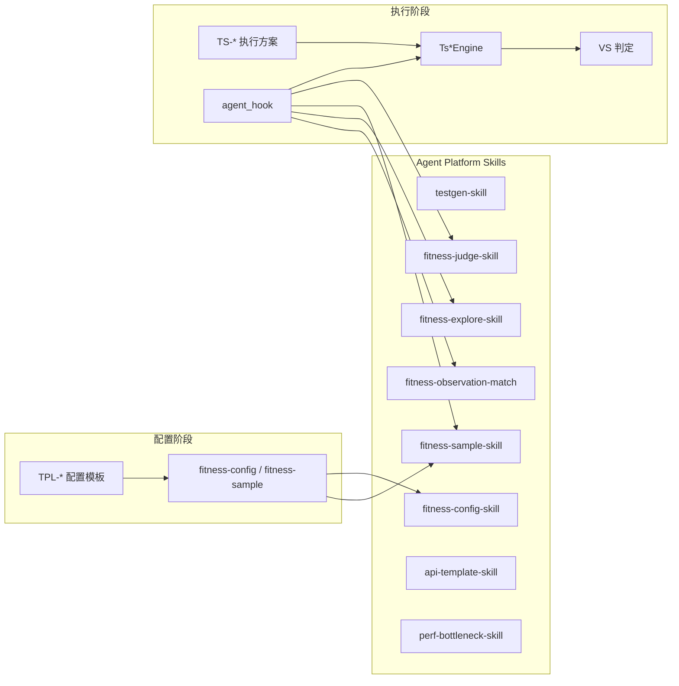

# Skill 与执行引擎关系梳理

> **更新**：2026-07-08  
> **范围**：`admin-management-station`（基座）+ `project-sub/testgen-sub`（测试平台子应用）  
> **关联**：[测试平台架构关系图](./测试平台架构关系图.md) · [设计-Agent协作与Skill嵌入](./设计-Agent协作与Skill嵌入.md) · [设计-Agent联调配置](./设计-Agent联调配置.md)

---

## 0. 术语说明

| 术语 | 含义 | 所在位置 |
|------|------|----------|
| **Agent Platform Skill** | 测试平台运行时通过 BFF `agentProxy` 调用的 AI 插件（本文「Skill」默认指此类） | `agent-management-sub/plugins/`（运行时挂载到 `agent-management-master/plugins/`） |
| **配置模板（TPL-*）** | 用例级执行配置的 UI/DB 形态，决定 `config_json` 结构 | `config_template_enum` 表 + `tpl_config_*` 表 |
| **执行方案（TS-*）** | 执行引擎路由 ID，Orchestrator 按此选择 `Ts*Engine` | `test_scheme_enum` 表 + `engineRegistry.js` |
| **VS 判定引擎** | 与 TS 正交的验证标准聚合器（契约/通过率/SLO 等） | `vsRegistry.js` + `validators/vs*.js` |
| **Cursor 开发 Skill** | IDE 辅助开发流程指引，**不参与测试执行** | `admin-management-station/skills/` |
| **被测系统 Skill** | fitness-agent 内部 Agent 路由能力（如 `plan-periodization`） | 被测对象，由 `E-SKILL-*` 测试项回归 |

> **关于「宏观 Skill」**：代码库中**不存在**名为 `macro skill` 的运行时组件。`C1-MACRO-*` 是业务测试项前缀（宏观训练计划），其执行方案为 `TS-05-CHAIN`，与 Agent Platform Skill 无关。

---

## 1. 项目边界

```
admin-management-station/                    # AMS 基座（Qiankun 主应用 + 子应用注册）
├── menu-master/                             # 主应用菜单、子应用挂载（testgen 入口）
├── skills/                                  # Cursor IDE 开发 Skill（非运行时）
├── docs-project/                            # 平台级文档（端口注册、架构图）
└── project-sub/
    └── testgen-sub/                         # ★ 测试平台本体（BFF + 前端 + DB + 执行引擎）
        ├── backend/app/service/
        │   ├── agentProxy.js                # Skill 统一网关
        │   └── execution/                   # TS 引擎 + VS 判定 + 编排
        ├── database/tables/                 # 模板/方案枚举与配置表
        └── docs/                            # 测试平台设计文档
```

测试平台**全部运行时逻辑**集中在 `testgen-sub`；`admin-management-station` 其余部分仅提供子应用注册、IDE 开发指引与平台级文档。

---

## 2. Agent Platform Skill 清单与使用位置

共 **11 个** Skill 经 BFF 接入（含执行期补齐三件套）。插件源码在 `agent-management-sub/plugins/`（运行时可 junction 到 `agent-management-master/plugins/`）。

### 2.1 总览表

| # | Skill | 插件路径 | BFF 封装 | 使用阶段 | 调用方文件 |
|---|-------|----------|----------|----------|------------|
| A1 | `testgen-skill` | `plugins/testgen-skill/` | `invokeTestgen` | 用例生成 | `generationJob.js` |
| A2 | `fitness-judge-skill` | `plugins/fitness-judge-skill/` | `invokeFitnessJudge` | 执行判定 / 评审 / 报告 | `agentHook.js`, `fitnessExecution.js`, `fitnessPlan.js`, `vsAgentJudge.js` |
| A3 | `fitness-sample-skill` | `plugins/fitness-sample-skill/` | `invokeFitnessSample` | 配置生成 / 样本补全 / 执行前 hook / **Autofill 按需** | `configTemplate.js`, `fitnessExecution.js`, `agentHook.js`, `autofillPipeline.js` |
| A4 | `fitness-config-skill` | `plugins/fitness-config-skill/` | `invokeFitnessConfig` | 配置模板 AI 生成 | `configTemplate.js` |
| A5 | `fitness-explore-skill` | `plugins/fitness-explore-skill/` | `invokeFitnessExplore` | TS-05 探索式多步规划 | `agentHook.js` → `ts05ChainEngine.js` |
| A6 | `fitness-observation-match-skill` | `plugins/fitness-observation-match-skill/` | `invokeObservationMatch` | TPL-API-CTX 内容语义比对 | `agentHook.js` |
| A7 | `api-template-skill` | `plugins/api-template-skill/` | `invokeApiTemplate` | 接口模板草案生成 | `apiTemplateGenerationJob.js` |
| A8 | `perf-bottleneck-skill` | `plugins/perf-bottleneck-skill/` | `invokePerfAnalysis` | 负载/性能瓶颈分析 | `fitnessExecution.js`, `testRun.js` |
| **A9** | `fitness-intent-classify-skill` | `plugins/fitness-intent-classify-skill/` | `invokeFitnessIntentClassify` | **执行前意图分类** | `autofillPipeline.js` |
| **A10** | `fitness-fixed-resolve-skill` | `plugins/fitness-fixed-resolve-skill/` | `invokeFitnessFixedResolve` | **执行前固定值解析** | `autofillPipeline.js` |
| **A11** | `fitness-config-structure-skill` | `plugins/fitness-config-structure-skill/` | `invokeFitnessConfigStructure` | **执行前配置结构补丁** | `autofillPipeline.js` |

> 执行期自动补齐：`RunOrchestrator.launch`（`autofill!==false`）→ `configCompletenessGate` → `AutofillPipeline`（N1→N2→N3→可选 N4）。详见 [计划-执行期配置AI自动补齐.md](./计划-执行期配置AI自动补齐.md)。

### 2.2 按业务链路分组

```
┌─────────────────────────────────────────────────────────────────────────┐
│                        testgen-sub BFF (agentProxy.js)                   │
├──────────────────┬────────────────────┬─────────────────────────────────┤
│ 生成链路          │ 配置链路            │ 执行 / 分析链路                  │
├──────────────────┼────────────────────┼─────────────────────────────────┤
│ testgen-skill     │ fitness-config     │ fitness-judge-skill              │
│  · estimate       │ fitness-sample     │ fitness-explore-skill            │
│  · generate_for   │ api-template       │ fitness-observation-match        │
│    _fitness       │                    │ perf-bottleneck-skill            │
│  · enrich_samples │                    │                                  │
└──────────────────┴────────────────────┴─────────────────────────────────┘
```

### 2.3 各 Skill 详细使用点

#### A1 · testgen-skill

| Action | 调用位置 | 场景 |
|--------|----------|------|
| `estimate_case_count` | `generationJob.js` | 生成前估算用例数量 |
| `generate_for_fitness` | `generationJob.js` | PRD/文档 → Fitness 结构化用例 |
| `enrich_samples` | `generationJob.js` | 生成完成后可选补全样本集 |

前端入口：`TestScopePage.vue`（勾选「完成后 AI 补全样本」触发 `enrich_samples`）

#### A2 · fitness-judge-skill

| Action | 调用位置 | 场景 |
|--------|----------|------|
| `judge` | `agentHook.js` | `use_agent_judge=true` 或 `post_sub_run` hook 时语义判定 |
| `explain` | `fitnessExecution.js` | 运行结果可解释性 |
| `pre_review` | `fitnessExecution.js` | TPL-MAN 人工评审队列预处理 |
| `summary` | `fitnessPlan.js` | 测试计划报告摘要 |

VS 路由：`vsRegistry.js` 在 `use_agent_judge=true` 时委托 `vsAgentJudge.js` → 再调 `judge`。

#### A3 · fitness-sample-skill

| Action | 调用位置 | 场景 |
|--------|----------|------|
| `from_example` | `configTemplate.js` | TPL-SET 配置页「AI 生成」 |
| `enrich_csv` | `fitnessExecution.js` | 样本集 CSV 智能补全 |
| `from_example`（hook） | `agentHook.js` | `pre_execute` hook（如 TS-04-SET） |

#### A4 · fitness-config-skill

| Action | 调用位置 | 场景 |
|--------|----------|------|
| `generate_det/bnd/rep/chain/pair/neg/obs/load` | `configTemplate.js` | 各 TPL 配置页「AI 生成」 |
| `generate_api_ctx` | `configTemplate.js` | TPL-API-CTX 配置页「AI 生成」 |
| `generate_config`（兜底） | `configTemplate.js` | `agent_action` 缺失时的 fallback |

绑定真源：`database/tables/config_template_enum/data.json` 的 `agent_skill` + `agent_action` 字段。

#### A5 · fitness-explore-skill

| Action | 调用位置 | 场景 |
|--------|----------|------|
| `plan` | `agentHook.js` | TS-05-CHAIN 探索循环，`config_json.agent_hook.explore` |

#### A6 · fitness-observation-match-skill

| Action | 调用位置 | 场景 |
|--------|----------|------|
| `match` | `agentHook.js` | TPL-API-CTX（`execution_mode: api_ctx`）期望观测 vs **poll/journey response** |

输出写入 `ft_run_result.assertion_detail.semantic`：`confidence`（0~1）、`confidence_percent`、`reasons`；`sub_verdict` 由 `semantic_threshold`（默认 0.75）决定。

#### A7 · api-template-skill

| Action | 调用位置 | 场景 |
|--------|----------|------|
| `generate` | `apiTemplateGenerationJob.js` | 文档 → `ft_api_template` 草案 |

前端入口：`ApiTemplateGenPage.vue`

#### A8 · perf-bottleneck-skill

| Action | 调用位置 | 场景 |
|--------|----------|------|
| `analyze_load_run` | `fitnessExecution.js` | Fitness TS-09 负载 run 后分析 |
| `analyze` | `testRun.js` | 旧版 test-runs 性能分析 |

### 2.4 配置模板 ↔ Skill 绑定（DB 真源）

| 模板 | 执行方案 | 配置生成 Skill | agent_action |
|------|----------|----------------|--------------|
| TPL-DET | TS-01-DET | fitness-config-skill | generate_det |
| TPL-BND | TS-02-BND | fitness-config-skill | generate_bnd |
| TPL-REP | TS-03-REP | fitness-config-skill | generate_rep |
| TPL-SET | TS-04-SET | fitness-sample-skill | from_example |
| TPL-CHAIN | TS-05-CHAIN | fitness-config-skill | generate_chain |
| TPL-API-CTX | TS-05-CHAIN | fitness-config-skill | generate_api_ctx |
| TPL-PAIR | TS-06-PAIR | fitness-config-skill | generate_pair |
| TPL-NEG | TS-07-NEG | fitness-config-skill | generate_neg |
| TPL-OBS | TS-08-OBS | fitness-config-skill | generate_obs |
| TPL-LOAD | TS-09-LOAD | fitness-config-skill | generate_load |
| TPL-MAN | TS-10-MAN | **无**（NULL） | — |

> TPL-MAN 不支持配置页 AI 生成，但运行后 `pre_review` 仍调用 `fitness-judge-skill`。

### 2.5 执行期 Agent Hook 嵌入点

定义于 `backend/app/service/execution/agentHook.js`，由 `runOrchestrator.js` 编排调用：

| Hook | 阶段 | 适用 TS | 典型 Skill |
|------|------|---------|------------|
| `pre_execute` | Runner 前 | TS-02/04/07 | fitness-sample-skill |
| `post_sub_run` | 单次 Runner 后 | TS-03/04/07 | fitness-judge-skill |
| `explore` | 链路扩展 | TS-05 | fitness-explore-skill |
| `vs_agent` | 判定 | 全 VS（`use_agent_judge: true`） | fitness-judge-skill |
| api_ctx 内容比对 | 单次 case 后 | TS-05（api_ctx 模式） | fitness-observation-match-skill |
| `explain` | 运行后 UX | — | fitness-judge-skill |

Hook 配置格式（`config_json`）：

```json
{
  "use_agent_judge": true,
  "rubric_id": "consult_quality_v1",
  "agent_hook": {
    "pre_execute": "fitness-sample-skill:from_example",
    "post_sub_run": "fitness-judge-skill:judge",
    "explore": "fitness-explore-skill:plan"
  }
}
```

### 2.6 前端 Skill 相关 UI

| 文件 | 用途 |
|------|------|
| `TemplateConfigShell.vue` | 展示 `agent_skill`，触发配置 AI 生成 |
| `TestScopePage.vue` | 用例生成 + `enrich_samples` 选项 |
| `ApiTemplateGenPage.vue` | 接口模板 Skill 生成入口 |
| `ToolChainTracePanel.vue` | Skill 调用审计日志（`ft_agent_audit_log`） |

### 2.7 Cursor 开发 Skill（非运行时）

`admin-management-station/skills/` 为 IDE 开发流程指引，**不参与测试执行**：

| Skill | 路径 | 用途 |
|-------|------|------|
| main-app-developer | `skills/main-app-developer/SKILL.md` | 基座开发 |
| sub-app-developer | `skills/sub-app-developer/SKILL.md` | 子应用脚手架 |
| testgen-sub-developer | `skills/project-developer/testgen-sub/SKILL.md` | testgen 业务迭代指引 |
| novel-sub-developer | `skills/project-developer/novel-sub/SKILL.md` | 与测试平台无关 |

---

## 3. 执行引擎与配置模板

### 3.1 三层架构

```
配置模板 (TPL-*)  →  执行方案 (TS-*)  →  TS 引擎 (ts*Engine.js)  →  VS 判定 (vsRegistry)
        ↑                      ↑
   Agent Skill            agent_hook
 (配置生成阶段)          (执行嵌入阶段)
```

注册中心：

| 层级 | 注册文件 |
|------|----------|
| TS 引擎 | `backend/app/service/execution/engineRegistry.js` |
| VS 判定 | `backend/app/service/execution/vsRegistry.js` |
| 模板（后端） | `backend/app/lib/configTemplateRegistry.js` |
| 模板（前端） | `frontend/src/components/config-templates/registry.js` |

### 3.2 TS 执行引擎 ↔ 配置模板（10 引擎 · 11 模板）

| 执行方案 | 引擎文件 | 默认模板 | 配置表 | 前端 Panel |
|----------|----------|----------|--------|------------|
| TS-01-DET | `engines/ts01DetEngine.js` | TPL-DET | tpl_config_det | TplDetPanel.vue |
| TS-02-BND | `engines/ts02BndEngine.js` | TPL-BND | tpl_config_bnd | TplBndPanel.vue |
| TS-03-REP | `engines/ts03RepEngine.js` | TPL-REP | tpl_config_rep | TplRepPanel.vue |
| TS-04-SET | `engines/ts04SetEngine.js` | TPL-SET | tpl_config_set | TplSetPanel.vue |
| TS-05-CHAIN | `engines/ts05ChainEngine.js` | TPL-CHAIN | tpl_config_chain | TplChainPanel.vue |
| TS-06-PAIR | `engines/ts06PairEngine.js` | TPL-PAIR | tpl_config_pair | TplPairPanel.vue |
| TS-07-NEG | `engines/ts07NegEngine.js` | TPL-NEG | tpl_config_neg | TplNegPanel.vue |
| TS-08-OBS | `engines/ts08ObsEngine.js` | TPL-OBS | tpl_config_obs | TplObsPanel.vue |
| TS-09-LOAD | `engines/ts09LoadEngine.js` | TPL-LOAD | tpl_config_load | TplLoadPanel.vue |
| TS-10-MAN | `engines/ts10ManEngine.js` | TPL-MAN | tpl_config_man | TplManPanel.vue |

**特殊映射：TPL-API-CTX 共用 TS-05-CHAIN 引擎**

| 模板 | 实际引擎 | 运行模式 | 配置表 | 前端 Panel |
|------|----------|----------|--------|------------|
| TPL-API-CTX | TS-05-CHAIN | `execution_mode: api_ctx` | tpl_config_api_ctx | TplApiCtxPanel.vue |

映射定义：

```javascript
// configTemplateRegistry.js
TEMPLATE_SCHEME_OVERRIDE: { 'TPL-API-CTX': 'TS-05-CHAIN' }
SCHEME_TEMPLATE_ALTERNATIVES: { 'TS-05-CHAIN': ['TPL-CHAIN', 'TPL-API-CTX'] }
```

混合 TS 大类（C1/C2/C3/C4）在用例级按 `scheme_primary_id` 解析模板，不走大类默认挂载。

### 3.3 底层 Runner（引擎复用，非独立 TS 引擎）

| Runner | 被谁使用 |
|--------|----------|
| `runners/httpRunner.js` | 多数 TS 引擎 |
| `runners/cliRunner.js` | ts01DetEngine, matrixRowRunner |
| `runners/matrixRowRunner.js` | ts02Bnd, ts05Chain |
| `runners/pairArmRunner.js` | ts06PairEngine |
| `runners/forbiddenScan.js` | ts06, ts07, apiCtxCaseRunner |
| `runners/journeyRunner.js` | ts08ObsEngine |
| `runners/apiTemplateContextRunner.js` | ts05Chain (api_ctx) |
| `runners/apiCtxCaseRunner.js` | api_ctx 单 case |
| `runners/varPool.js` | chain / api_ctx 变量池 |

### 3.4 VS 判定引擎（验证标准，与 TS 正交）

| VS 引擎文件 | 对应 validation_id |
|-------------|-------------------|
| `validators/vsContract.js` | VS-01, VS-02 |
| `validators/vsZero.js` | VS-03 |
| `validators/vsChain.js` | VS-04 |
| `validators/vsObs.js` | VS-05, VS-06 |
| `validators/vsRate.js` | VS-07 |
| `validators/vsPassK.js` | VS-08 |
| `validators/vsBlockRate.js` | VS-09 |
| `validators/vsSlo.js` | VS-10 |
| `validators/vsMajority.js` | VS-11 |
| `validators/vsAgentJudge.js` | `use_agent_judge=true` 时覆盖 |

### 3.5 执行编排入口

```
FtRunConfig (item_id + scheme_id)
    ↓
runOrchestrator.js
    ├─ agentHook.runPreExecute()          # pre_execute hook
    ├─ engineRegistry.get(scheme_id)      # TS 引擎执行
    ├─ applyApiCtxContentJudge()          # api_ctx 内容比对 → 语义置信度
    ├─ applyPostSubRunJudge()             # post_sub_run / use_agent_judge
    └─ vsRegistry.get(validation_id)    # 总判定 verdict
```

**TPL-API-CTX 语义置信度展示（2026-07-08）**

| 层级 | 字段/表 | 说明 |
|------|---------|------|
| 样本输入 | `ft_run_result.input_summary` | 每条样本 **message** 文案（非 HTTP path） |
| Agent 输出 | `ft_run_result.output_summary` | **response** 节选；全文在 `assertion_detail.semantic.response_full` |
| 语义判定 | `assertion_detail.semantic.confidence_percent` | AI 比对期望观测后的 **置信度 0~100%** |
| 单样本 pass | `sub_verdict` | `confidence >= threshold_json.semantic_threshold`（默认 0.75） |
| Run 达标率 | VS-07 | 仍统计 `sub_verdict=pass` 样本占比 |

实现文件：`lib/apiCtxSemantic.js` · `agentHook.applyApiCtxContentJudge` · 控制台 `FitnessRunConsolePage`（api_ctx 专用列）

引用表：`ft_run_result` · `test_item_detail.expected_observation` · `ft_run_config.threshold_json` · `ft_api_template.content_extract_paths`

API 入口：`fitnessExecution.js` → `/api/fitness/runs/*`；批量：`planBatchRunner.js`。

### 3.6 关系总图



---

## 4. 空闲 / 可删除项分析

### 4.1 Agent Platform Skill：**8 个全部在用，无可删除项**

经 `agentProxy.js` 交叉核对，8 个 Skill 均有 BFF 接线与业务调用方，**不建议删除任何一个**。

| Skill | 结论 |
|-------|------|
| testgen-skill | ✅ 用例生成链路必需 |
| fitness-judge-skill | ✅ 语义判定 / 人工评审 / 计划报告 |
| fitness-sample-skill | ✅ TPL-SET 配置 + 样本补全 + pre_execute hook |
| fitness-config-skill | ✅ 9 套 TPL 配置 AI 生成 |
| fitness-explore-skill | ✅ TS-05 探索循环 |
| fitness-observation-match-skill | ✅ TPL-API-CTX 内容比对 |
| api-template-skill | ✅ 接口模板生成 |
| perf-bottleneck-skill | ✅ 负载分析（Fitness + 旧 test-runs） |

### 4.2 Skill Action 级：部分能力未从 BFF 直接调用

以下为插件已实现、但 **BFF 代码未显式调用** 的 action（保留在插件内供 Agent Loop 或未来接线）：

| Skill | 未接 BFF 的 Action | 说明 |
|-------|-------------------|------|
| testgen-skill | `generate`（通用）、`validate_draft`、`register-doc`、`list`、`get` | 设计文档规划能力；BFF 仅用 `estimate_case_count` / `generate_for_fitness` / `enrich_samples` |
| fitness-sample-skill | `expand_matrix`、`gen_adversarial` | 设计文档规划用于 TS-02/TS-07；当前配置生成走 fitness-config-skill |
| fitness-judge-skill | `list-rubrics` | 仅 `agent-linkage-smoke.js` 探活使用 |
| perf-bottleneck-skill | `list`、`get` | 插件管理 action，BFF 未调用 |

**建议**：这些是 action 级冗余，不是独立 Skill；可保留供 Agent 平台直接调用，或在确认无外部依赖后从插件精简，**不影响 BFF 删除任何 Skill 插件**。

### 4.3 Agent 平台其他插件：与测试平台无关

`agent-management-master/plugins/` 中存在 **未接入 testgen** 的插件：

| 插件 | 状态 |
|------|------|
| weather-skill | ❌ testgen 无引用 |
| research-skill | ❌ testgen 无引用 |
| qa-skill | ❌ testgen 无引用 |
| note-skill | ❌ testgen 无引用 |

这些属于 Agent 平台通用/demo 插件，**不影响测试平台运行**；若仅维护 Fitness 测试体系，可在 Agent 平台部署配置中不加载，但不宜在 testgen 仓库内删除（源码不在 testgen-sub）。

### 4.4 TS 执行引擎：**10 个全部对齐，无孤立引擎**

| 检查项 | 结果 |
|--------|------|
| `engineRegistry.js` 注册数 | 10（TS-01 ~ TS-10） |
| `test_scheme_enum` 枚举数 | 10 |
| `config_template_enum` 模板数 | 11（TPL-API-CTX 共用 TS-05） |
| 前端 `TEMPLATE_COMPONENTS` | 11 Panel 全部对应 |
| `tpl_config_*` 配置表 | 11 张表全部对应 |

**结论**：不存在「有引擎无模板」或「有模板无引擎」的孤立项。TPL-API-CTX **故意**共用 TS-05-CHAIN，不是冗余引擎。

### 4.5 遗留执行栈：并行存在，暂不可删

| 组件 | 路径 | 状态 | 说明 |
|------|------|------|------|
| `executionEngine.js` | `backend/app/service/executionEngine.js` | ⚠️ 遗留共用工具 | 被 `ts01DetEngine`（HTTP 断言）和 `testRun.js` 调用 |
| `testRun.js` | `backend/app/service/testRun.js` | ⚠️ 旧版执行栈 | 路由 `/api/test-runs/*` 仍注册；前端 `TestRunMonitorPage.vue` 仍引用 |
| Fitness `FtRun` 体系 | `fitnessExecution.js` + `runOrchestrator.js` | ✅ 主路径 | 383 条结构化测试项的执行主链路 |

**建议**：旧 `test-runs` 栈与 Fitness `ft_run` 并行。若产品已全面切到 Fitness 执行，可规划废弃 `testRun.js` + 相关前端页面，但当前**不能安全删除**（仍有路由与 UI）。

### 4.6 文档 / 探活脚本不一致（非运行时冗余）

| 项 | 问题 | 建议 |
|----|------|------|
| `agent-linkage-smoke.js` | `EXPECTED_SKILLS` 仅列 5 个，缺 observation-match / api-template / perf | 更新探活列表至 8 个 |
| `设计-Agent协作与Skill嵌入.md` | 标题写「6 个 Skill」 | 更新文档为 8 个 |
| `测试平台架构关系图.md` | TPL-MAN 误标 fitness-config-skill | DB 真源为 NULL |
| `FitnessRunLaunchPage.vue` | 提示「已实现 TS-01～08」 | 实际已含 TS-09/10 |

---

## 5. 快速对照总表

| 模板 | Scheme | 引擎 | 配置 Skill | 执行期 Skill |
|------|--------|------|------------|--------------|
| TPL-DET | TS-01-DET | ts01DetEngine | fitness-config | judge（可选） |
| TPL-BND | TS-02-BND | ts02BndEngine | fitness-config | judge（可选） |
| TPL-REP | TS-03-REP | ts03RepEngine | fitness-config | judge（可选） |
| TPL-SET | TS-04-SET | ts04SetEngine | fitness-sample | sample pre_execute + judge |
| TPL-CHAIN | TS-05-CHAIN | ts05ChainEngine | fitness-config | explore + judge |
| TPL-API-CTX | TS-05-CHAIN | ts05ChainEngine | fitness-config | observation-match + judge |
| TPL-PAIR | TS-06-PAIR | ts06PairEngine | fitness-config | judge（可选） |
| TPL-NEG | TS-07-NEG | ts07NegEngine | fitness-config | judge（可选） |
| TPL-OBS | TS-08-OBS | ts08ObsEngine | fitness-config | judge（可选） |
| TPL-LOAD | TS-09-LOAD | ts09LoadEngine | fitness-config | perf-bottleneck（分析） |
| TPL-MAN | TS-10-MAN | ts10ManEngine | — | fitness-judge pre_review |

---

## 6. 关键文件索引

| 类别 | 文件 |
|------|------|
| Skill 网关 | `backend/app/service/agentProxy.js` |
| Skill 配置 | `backend/config/config.default.js` → `config.agentPlatform` |
| 模板 ↔ Skill DB | `database/tables/config_template_enum/data.json` |
| TS 引擎注册 | `backend/app/service/execution/engineRegistry.js` |
| VS 判定注册 | `backend/app/service/execution/vsRegistry.js` |
| 模板注册（后端） | `backend/app/lib/configTemplateRegistry.js` |
| 模板注册（前端） | `frontend/src/components/config-templates/registry.js` |
| 执行编排 | `backend/app/service/execution/runOrchestrator.js` |
| Agent Hook | `backend/app/service/execution/agentHook.js` |
| 用例前缀路由 | `database/scheme-map.json` |
| 大类默认模板 | `database/tables/test_category_major_template/` |
| Skill 探活 | `backend/scripts/agent-linkage-smoke.js` |
| AMS 子应用注册 | `menu-master/frontend/src/qiankun/config.js` |
| Cursor 开发 Skill | `admin-management-station/skills/project-developer/testgen-sub/SKILL.md` |
