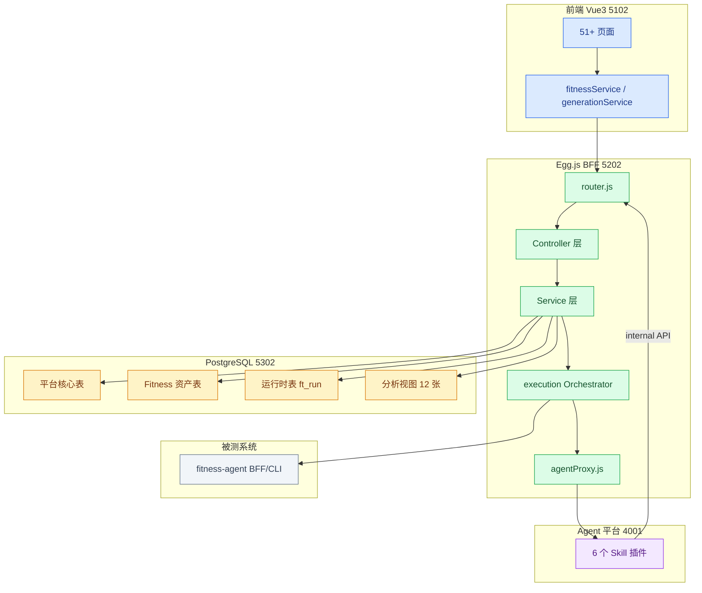
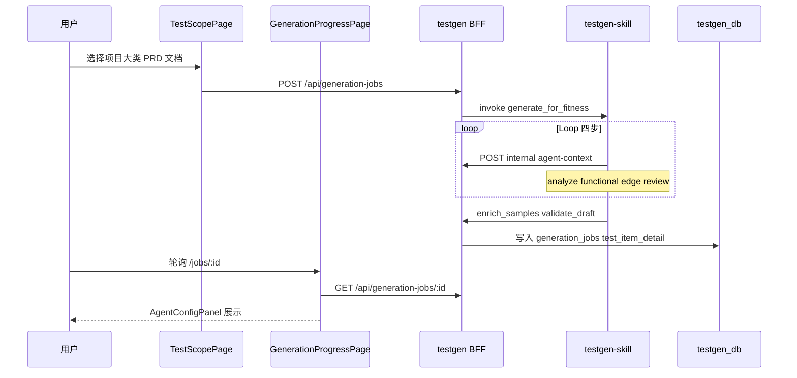
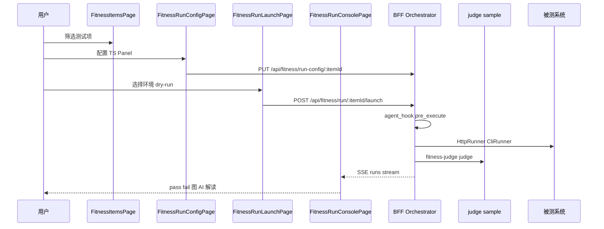
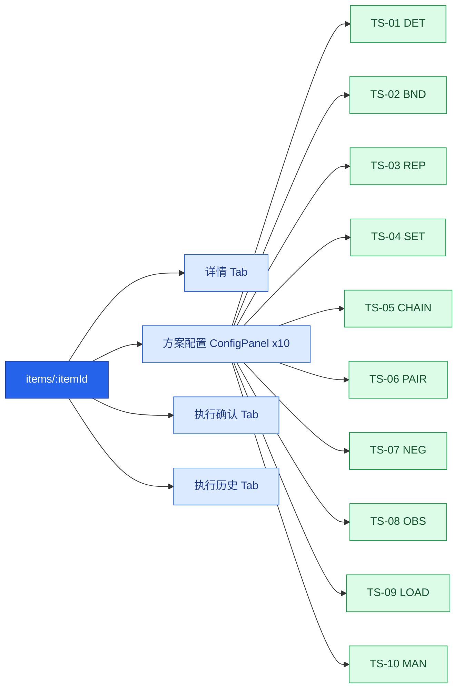
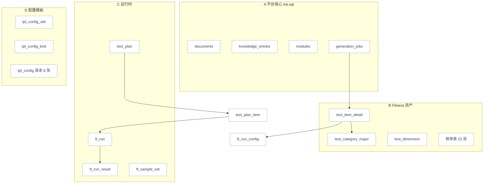
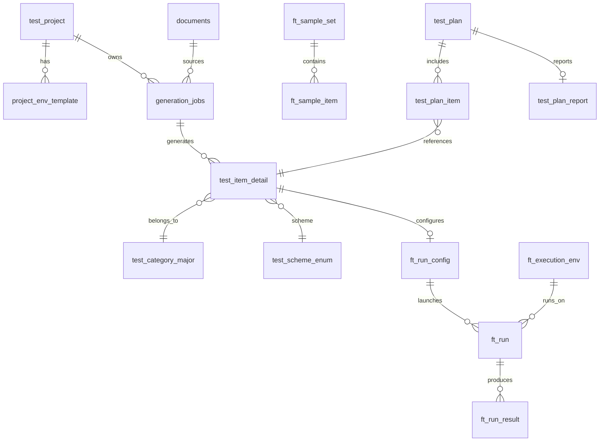
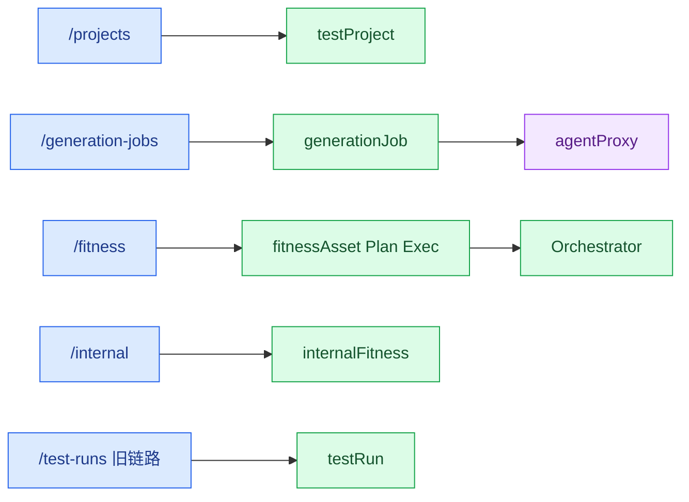
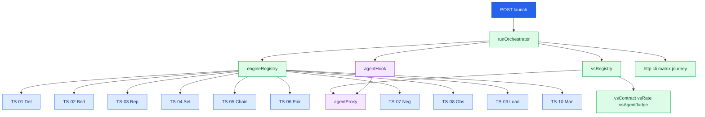
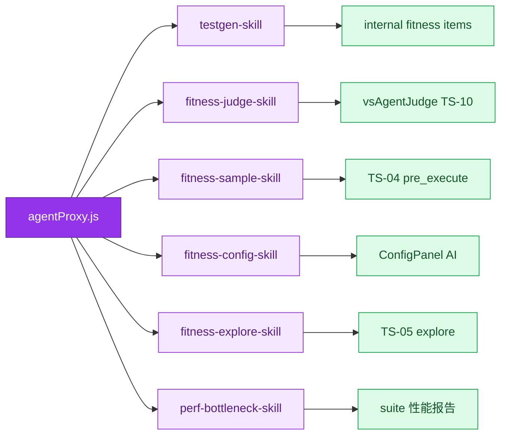

# testgen-sub 测试平台架构与关系图

> 更新：2026-07-02  
> 范围：AI 智能测试平台前端交互、数据库、执行引擎、Agent 协作  
> 评分与待办 → [项目评分与后续计划.md](./项目评分与后续计划.md) · [文档索引](./README.md)

**图例**：蓝色=前端 · 绿色=BFF/引擎 · 橙色=数据库 · 紫色=Agent · 灰色=外部系统

---

## 1. 平台定位

`testgen-sub` 是 AMS 下的自包含子应用（`app_key=testgen`），承担两大核心能力：

1. **测试用例生成链路**：PRD/文档 → Agent 生成 → 写入用例库
2. **Fitness 测试体系**：383 条结构化测试项 + 10 套 TS 执行引擎 + 计划/执行/洞察

---

## 2. 整体架构图

---

## 3. 前端页面交互关系

### 3.1 导航域划分

```mermaid
flowchart TB
    classDef root fill:#1E3A8A,stroke:#1E40AF,color:#fff
    classDef nav fill:#DBEAFE,stroke:#2563EB,color:#1E3A8A
    classDef leaf fill:#EFF6FF,stroke:#93C5FD,color:#1E40AF
    classDef warn fill:#FEF3C7,stroke:#D97706,color:#78350F

    Root["MainLayout"]:::root
    Root --> Project["项目管理"]:::nav
    Root --> Testgen["测试用例生成"]:::nav
    Root --> Config["配置管理"]:::nav
    Root --> Fitness["Fitness 测试体系"]:::nav

    Project --> PL["/projects 列表"]:::leaf
    Project --> PD["/projects/:code 详情"]:::leaf

    Testgen --> Scope["/testgen/scope"]:::leaf
    Testgen --> Items["/testgen/items 用例库"]:::leaf
    Testgen --> Jobs["/jobs/:id 进度"]:::leaf

    Config --> Tpl["/config/templates"]:::leaf
    Config --> Enum["/fitness/settings/enums"]:::leaf

    Fitness --> Dash["/fitness/dashboard"]:::leaf
    Fitness --> Assets["/fitness/assets"]:::leaf
    Fitness --> Insights["/fitness/insights"]:::leaf
    Fitness --> Plans["/fitness/plans"]:::leaf
    Fitness --> ExecNav["/fitness/execution"]:::leaf
    Fitness --> Topics["/fitness/topics 占位"]:::warn
```

### 3.2 核心业务流：用例生成

### 3.3 核心业务流：Fitness 执行

### 3.4 测试项详情 Tab 结构

---

## 4. 数据库表关系图

### 4.1 分层概览

### 4.2 核心 ER 关系（简化）

### 4.3 表数量统计

| 分层 | 数量 | 说明 |
|------|:----:|------|
| 平台核心 | 4 | documents, knowledge, modules, generation_jobs |
| 旧链路 | 5 | env_configs, test_runs, func/perf_results |
| Fitness 种子表 | 23+ | 分类、枚举、test_item_detail（383 条） |
| 分析视图 | 12 | v_metric_*, v_analysis_*, v_risk_* |
| 运行时 | 12 | test_plan_*, ft_* |
| 配置模板 | 10 | tpl_config_* |

---

## 5. 后端 API 与执行引擎

### 5.1 API 域划分

### 5.2 执行引擎架构

### 5.3 Agent 代理调用关系

---

## 6. 52 大类与 10 套 TS 模板映射

| 模板 | TS 方案 | 关联 Skill | 测试平台页面 |
|------|---------|------------|--------------|
| TPL-DET | TS-01 确定性单次 | fitness-config-skill | ConfigDetPanel |
| TPL-BND | TS-02 边界矩阵 | fitness-config + fitness-sample | ConfigBndPanel |
| TPL-REP | TS-03 重复抽样 | fitness-config-skill | ConfigRepPanel |
| TPL-SET | TS-04 固定样本集 | fitness-sample-skill | ConfigSetPanel |
| TPL-CHAIN | TS-05 多步链路 | fitness-config + fitness-explore | ConfigChainPanel |
| TPL-PAIR | TS-06 对照对比 | fitness-config-skill | ConfigPairPanel |
| TPL-NEG | TS-07 对抗专项 | fitness-sample-skill | ConfigNegPanel |
| TPL-OBS | TS-08 可观测稽核 | fitness-config-skill | ConfigObsPanel |
| TPL-LOAD | TS-09 压测容量 | fitness-config + perf-bottleneck | ConfigLoadPanel |
| TPL-MAN | TS-10 人工评审 | fitness-judge-skill | ConfigManPanel |

详细大类映射见 [设计-配置模板与52大类.md](./设计-配置模板与52大类.md)

---

## 7. 相关文档索引

| 文档 | 路径 |
|------|------|
| **文档索引** | [README.md](./README.md) |
| **项目评分与后续计划** | [项目评分与后续计划.md](./项目评分与后续计划.md) |
| 配置模板设计 | [设计-配置模板与52大类.md](./设计-配置模板与52大类.md) |
| Agent 协作设计 | [设计-Agent协作与Skill嵌入.md](./设计-Agent协作与Skill嵌入.md) |
| Agent 联调 | [设计-Agent联调配置.md](./设计-Agent联调配置.md) |
| 待开发节点 | [待办-开发节点追踪.md](./待办-开发节点追踪.md) |
| Agent 任务清单 | [待办-Agent开发任务清单.md](./待办-Agent开发任务清单.md) |
| 启动说明 | [../README.md](../README.md) |
| AMS 平台关系 | [../../docs-project/AMS平台架构关系图.md](../../docs-project/AMS平台架构关系图.md) |
