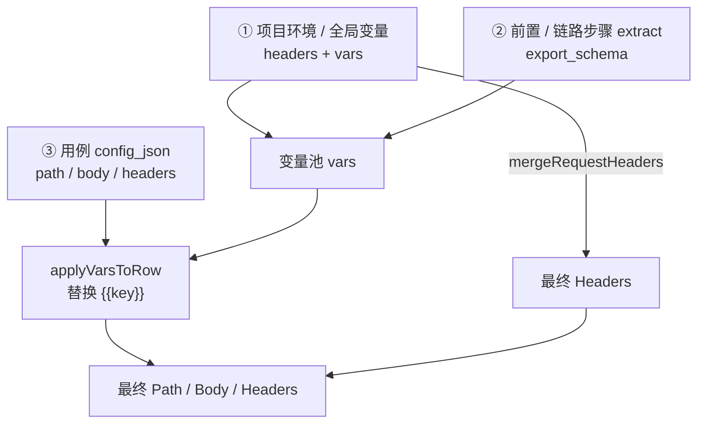

# 配置模板通用约定

> 所有 TPL-* 共用的环境、变量、接口模板规则。配置某一具体模板前请先读本文。

---

## 1. 配置三层来源

执行一次 HTTP 用例时，请求由三层拼装：



| 层级 | 在哪配置 | 进入请求的方式 |
|------|----------|----------------|
| **执行环境** | 项目管理 → 环境；或 Fitness「环境与服务端点」 | `base_url`/`bff_coach_url` 作为主机；`auth_configured.global_headers` 合并进请求头；`fixed_params` 进入变量池 |
| **项目全局变量** | 项目管理 → 详情 →「全局变量」Tab | 仅 `source=manual` 且有值 → 变量池 keys |
| **用例配置** | 用例 → 配置模板页 | path/body/headers、前置入参、matrix/steps 等；用 `{{key}}` 引用上两层或前置抛出字段 |

执行加载逻辑：`backend/app/lib/globalRequestContext.js`（`loadGlobalRequestContext`）。

---

## 2. 项目管理页：环境 vs 变量

### 2.1 环境模板（域名 / 认证 / DB）

页面：`ProjectEnvironmentsPage`（项目详情 → 环境配置）

| 字段 | 作用 | 启用建议 |
|------|------|----------|
| `name` / `tier` | 环境显示名与层级 | 必填 |
| `base_url` | HTTP 主机，如 `https://lejian-api.bboycc.cn` | Fitness 侧也可能用 `bff_coach_url`，以当前执行读的 env 为准 |
| `base_path` | 基础路径前缀，多数填 `/` | 勿重复拼进用例 Path |
| `auth_type` | none / bearer / basic / apikey | 文档类开放 API 可选 `none`；需 Token 时选 bearer 并填凭证 |
| DB 主机等 | CLI / 站级连通 | 纯 HTTP 可空 |

Fitness 环境页额外支持 `auth_configured`：

```json
{
  "global_headers": {
    "Authorization": "Bearer eyJhbGciOi...",
    "X-Internal-Service-Key": "dev-key"
  },
  "fixed_params": {
    "token": "eyJhbGciOi...",
    "openid": "oa_xxx",
    "store_code": "123456"
  },
  "database_url": "postgres://..."
}
```

- **global_headers**：每次请求默认带上（用例 Headers 同名 key 可覆盖）
- **fixed_params**：进入变量池，配置里写 `{{token}}` / `{{openid}}` 即可引用

### 2.2 全局变量 Tab

页面：`ProjectVariablesPage`

| 列 | 说明 |
|----|------|
| `key` | 变量名，对应 `{{key}}` |
| `value` | 静态默认值 |
| `source` | `manual`：运行时注入；`extract`：**当前运行时不会自动提取**（仅落库/UI，见缺口文档 ENV/X-02） |
| `extract_path` / `from_step` | 预留给链路提取，暂未接入 `loadGlobalRequestContext`；执行期自动补齐也**不得**假设 extract 可用 |

执行环境加载已按 **`project_code` 隔离**（见缺口 ENV-01）：用例所属项目之外的 `ft_execution_env` 不会被默认选中。

**举例：把项目变量接到主请求 Body**

1. 变量页新增：`openid` = `oa_1E3fSh4Dei_L33BoEHRyLLpQg`（manual）
2. 环境 `fixed_params` 也可放同一 key（后写合并以变量加载顺序为准，避免两个入口互相覆盖时不明）
3. 用例 Body：

```json
{
  "openid": "{{openid}}",
  "store_code": "{{store_code}}"
}
```

4. Headers（若环境未配全局头，也可在用例手写）：

```json
{
  "Authorization": "Bearer {{token}}"
}
```

配置页**没有**「点选插入变量」下拉：需手写 `{{key}}`。`HttpBodyFormItems` 仅有文案提示。

---

## 3. 占位符语法

实现：`backend/app/service/execution/runners/varPool.js`

| 写法 | 适用位置 | 行为 |
|------|----------|------|
| `{{key}}` | Path / Body / Headers 任意字符串 | 替换为变量池值；缺失 → 空串 |
| `{key}` 或 `:key` | **仅 Path**（第二遍） | URL encode；接口模板 path 绑定常用 |
| `uuid` | 特殊内置 | 一般不参与「缺失」校验 |

Path 上仍有未替换的 `{{...}}` 会报 `UNRESOLVED_PATH_PLACEHOLDER`（400）。

**推荐**

```text
Path:   /api/chat/turns/{{turn_id}}
Body:   {"session_id":"{{session_id}}","message":"你好"}
Header: {"Authorization":"Bearer {{token}}"}
```

---

## 4. 接口模板（ft_api_template）扮演什么角色

在「接口模板管理」维护的可复用 HTTP 流程，关键字段：

| 字段 | 含义 |
|------|------|
| `preflight_steps` | 前置步骤（可 extract 进变量池） |
| `export_schema` | 对外抛出字段清单（给 DET 主请求引导） |
| `input_params_schema` | 外部入参及 `bind_to`（context/query/body/path/header） |
| `inject_schema` | 需注入的业务字段（文本 / 样本集） |
| `url_path` / `body_template` / `poll_json` | 模板主请求与轮询 |

**两种用例侧用法（勿混淆）**

| 模式 | 模板 | 用例侧配置什么 | 主请求谁写 |
|------|------|----------------|------------|
| **前置取参** | TPL-DET | `preflight_api_template_id` + 可选入参 | **用例手写** Path/Body/Headers，用 `{{export字段}}` |
| **完整上下文** | TPL-API-CTX | `api_template_id` + `input_params` + `inject_bindings` | **模板定义** 的主请求 + inject；用例不手写 Path |

旧 DET 字段 `use_api_template` + `inject_bindings` 在现 UI **保存时强制清空**，请改用 TPL-API-CTX。

`bind_to` 约定见 `frontend/src/utils/apiTemplateParamBind.js`：

- `context`：只进变量池，供 `{{key}}` / 前置
- `query` / `body` / `path` / `header`：写入对应 HTTP 部位

---

## 5. DET vs API-CTX 怎么选

| 需求 | 选 |
|------|----|
| 主接口 Path/Body 与模板不同（例如只 poll、或断言另一 URL） | **TPL-DET + 前置关联** |
| 整段复用模板（bootstrap → inject → submit → poll） | **TPL-API-CTX** |
| 完全自定义多步、不依赖接口模板 | **TPL-CHAIN** |

---

## 6. 执行与验证选型提示

| 配置项 | 位置 | 说明 |
|--------|------|------|
| `scheme_primary_id` | 用例详情 | 决定默认模板与引擎 |
| `template_code` | 用例详情 / 混合切换 | 可覆盖默认模板 |
| `validation_primary_id` | 配置外壳 `TemplateConfigShell` | 主验证方案（VS-*） |
| 辅验证 | 同左 | `TPL-DET` 隐藏辅验证（`TEMPLATES_WITHOUT_SECONDARY_VALIDATION`） |

保存后：选定执行环境 → Launch Run → 引擎按 TS 执行。

---

## 6.5 执行期配置自动补齐（Autofill）

launch 时若 `autofill !== false`（默认开启）：

1. `configCompletenessGate` 检查 DET 等必填项（仅 **fixed** 缺口阻断）
2. 不全则 `AutofillPipeline`：意图分类 → 固定值解析 → 结构补丁 → 可选样本
3. 固定值无法从**本项目**环境/接口模板解析 → `CONFIG_AUTOFILL_BLOCKED`（含 `config_snapshot` + `missing_fixed` + `project_code`/`env_*`）
4. 开关：`autofill: false` 跳过；`persist_autofill: true` 时可回写策略扩展（默认写本 run 的 `ft_run_config`）

意图禁忌：401 不回填正确鉴权；400 缺字段不「好心补全」。详见 [计划-执行期配置AI自动补齐.md](../计划-执行期配置AI自动补齐.md)。

---

## 7. 最短联调检查清单

1. 项目环境已配 `base_url`（或 Fitness `bff_coach_url`）；**环境按 `project_code` 隔离**（migration `038`）
2. 需要鉴权时：`global_headers` 或 Bearer / `{{token}}`
3. 业务主键（openid / session_id 等）落在 `fixed_params` 或全局变量（manual）
4. 需要会话态时：接口模板配置好 `preflight_steps` + `export_schema`
5. 用例 Path/Body 使用 `{{...}}`，与 export / 全局变量 key **完全一致**（区分大小写）
6. 发起 run 前保存 config_json；缺配置时可依赖 Autofill 或根据 `missing_fixed` 补环境/模板
