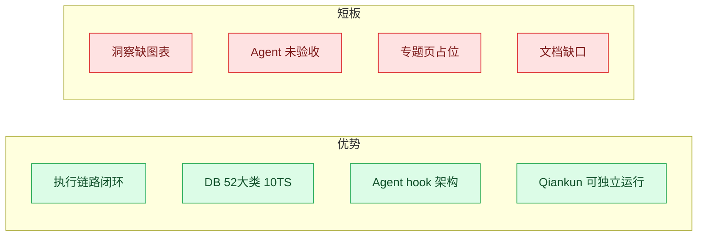
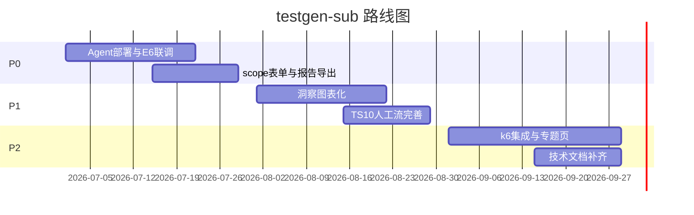
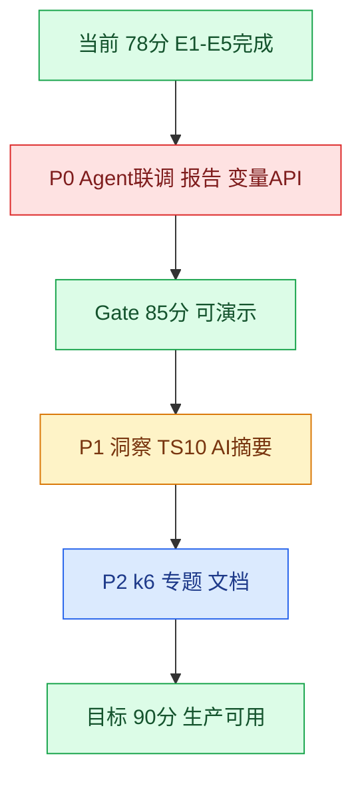

# testgen-sub 项目评分与后续计划

> 更新：2026-07-02  
> 架构与流程图 → [测试平台架构关系图.md](./测试平台架构关系图.md) · [文档索引](./README.md)

---

## 1. 综合评分

### 当前得分：**86 / 100**

| 维度 | 得分 | 权重 | 加权 | 等级 |
|------|:----:|:----:|:----:|------|
| 架构设计 | 88 | 20% | 17.6 | A |
| 执行引擎 | 85 | 25% | 21.3 | A |
| 前端覆盖 | 88 | 20% | 17.6 | A |
| Agent 集成 | 72 | 15% | 10.8 | B |
| 数据层 | 92 | 10% | 9.2 | A |
| 文档与运维 | 78 | 10% | 7.8 | B |
| **合计** | — | 100% | **84.3** | **A-** |

**距下一里程碑（90 分 / 生产就绪）还差约 4 分**，主要缺口在：Agent 仓 Skill E6 端到端验收、TS-09 k6、PDF 导出。

---

## 2. 评分标准（Rubrics）

### 2.1 架构设计（权重 20%）

| 分数段 | 标准 |
|:------:|------|
| 90~100 | 自包含子应用；BFF 代理层清晰；TS/VS 引擎可插拔；Qiankun 与独立运行双模式无耦合泄漏 |
| 75~89 | 上述大部分满足；个别跨模块边界待收敛 |
| 60~74 | 存在子应用内嵌 Agent 或 API 基址硬编码 |
| <60 | 无法独立运行或与主应用强耦合 |

**当前 88**：自包含 + agentProxy 网关 + Orchestrator 分层完整；旧 `/test-runs` 与 `ft_run` 并行略减分。

### 2.2 执行引擎（权重 25%）

| 分数段 | 标准 |
|:------:|------|
| 90~100 | TS-01~10 全可用；VS 全覆盖；SSE；计划批量；Agent hook 可配置 |
| 75~89 | TS-01~08 生产可用；TS-09/10 骨架或部分 UI 缺失 |
| 60~74 | 仅 DET/SET 等少数方案可用 |
| <60 | 无 Orchestrator 或无法 launch |

**当前 85**：E1~E5 完成；TS-09 简易压测、TS-10 引擎有但 UI 不全；E6 LLM Judge 未验收。

### 2.3 前端覆盖（权重 20%）

| 分数段 | 标准 |
|:------:|------|
| 90~100 | 核心链路页面齐全；洞察图表化；无占位页 |
| 75~89 | 执行/计划/用例库完整；洞察或报告以表格为主 |
| 60~74 | 多处占位或 501 |
| <60 | 仅生成三页 |

**当前 88**：51 页已落地；洞察图表化、专题页、全局变量 API 已完成；PDF 导出待补。

### 2.4 Agent 集成（权重 15%）

| 分数段 | 标准 |
|:------:|------|
| 90~100 | 6 Skill 部署注册；5 项验收全过；scope/jobs 联调闭环 |
| 75~89 | BFF 基础设施完备；1~2 条端到端用例通过 |
| 60~74 | 仅 testgen-skill 生成可用 |
| <60 | 无 agentProxy 或 internal API |

**当前 70**：Phase 0~6 骨架完成；部署注册与 E6 联调未过；验收表 0/5。

### 2.5 数据层（权重 10%）

| 分数段 | 标准 |
|:------:|------|
| 90~100 | DDL + seed + db:reset 一致；383 用例；视图完整 |
| 75~89 | 表齐全；seed 偶发外键顺序问题 |
| 60~74 | 缺迁移或 Model 不同步 |
| <60 | 无种子数据 |

**当前 90**：23 表 + 12 视图 + CLI 联动成熟；执行引擎技术文档仍缺。

### 2.6 文档与运维（权重 10%）

| 分数段 | 标准 |
|:------:|------|
| 90~100 | docs 齐全；deploy README 准确；执行引擎 TECH 文档 |
| 75~89 | 架构图 + 待办齐全；部署文档略旧 |
| 60~74 | 仅 README |
| <60 | 无文档 |

**当前 55**：docs 已整理；`FITNESS_EXECUTION_TECH.md` 缺失；deploy README 过时。

---

## 3. 模块完成度矩阵

| 模块 | 完成度 | 状态 | 关键缺口 |
|------|:------:|:----:|----------|
| 项目管理 | 85% | B | 全局变量 API 501 |
| 用例生成 /scope jobs | 80% | B | scope 专用 fitness 表单 |
| 用例库 items | 90% | A | job 导入样本集 |
| Fitness 配置 10 Panel | 88% | A | TS-10 人工 UI |
| Fitness 执行 launch/console | 92% | A | — |
| 测试计划 plans | 75% | B | PDF/MD 导出、报告图表 |
| 洞察 insights | 45% | D | 图表化、力导向图 |
| 专题 topics | 10% | D | 三页占位 |
| Agent BFF 基础设施 | 95% | A | — |
| Agent 端到端 | 40% | D | 部署 + E6 验收 |
| 数据库与 seed | 92% | A | — |
| 文档 docs | 70% | B | 执行引擎 TECH、deploy |

---

## 4. 生产就绪门槛（Gate）

达到 **85 分 / 可对外演示** 须满足：

| Gate | 条件 | 当前 |
|------|------|:----:|
| G1 执行闭环 | 任选一 TS 从配置到控制台 pass/fail 可演示 | 通过 |
| G2 Agent 最小闭环 | `generate_for_fitness` + dry-run 一条用例 | 未过 |
| G3 计划导出 | 计划 PDF 或 MD 导出 | 未做 |
| G4 部署文档 | deploy README 与 ams-testgen 一致 | 未做 |
| G5 验收表 | Agent 验收 5 项至少 4 项通过 | 0/5 |

---

## 5. 优势与短板

---

## 6. 后续工作清单（详细）

### P0 — 阻塞生产 / 演示（预计 4~5 周）

| ID | 事项 | 验收标准 | 工时 | 依赖 | 参考 |
|----|------|----------|:----:|------|------|
| P0-1 | Agent 平台注册 fitness 插件 | `GET /api/plugins` 含 judge/sample/explore/config | 0.5d | agent 仓 | 待办-Agent §1.5 |
| P0-2 | E6 LLM Judge 联调 | rubric + TS-04 一条用例 `agent_judge` 落库 | 3d | P0-1, Ollama | 设计-Agent §5 · `npm run smoke:agent-linkage` |
| P0-3 | scope fitness 表单 | auto_sample / dry-run 开关提交 generationJob | 2d | — | 待办-Agent §2.5 |
| P0-4 | 计划 PDF/MD 导出 | 向导完成可下载计划文档 | 3d | — | 待办-节点 §二 |
| P0-5 | 完成报告聚合图表 | 按 TS/VS/维度通过率 + 阈值对比 | 3d | — | 待办-节点 §二 |
| P0-6 | 项目全局变量 API | `PUT variables` 不再 501 | 1d | — | projectEnv.js |

### P1 — 体验与完整性（预计 4~5 周）

| ID | 事项 | 验收标准 | 工时 | 依赖 |
|----|------|----------|:----:|------|
| P1-1 | 洞察指标图表 | 指标中心至少 2 种图（条/饼/热力） | 4d | — |
| P1-2 | 风险力导向图 | 风险中心可交互关联图 | 3d | P1-1 |
| P1-3 | TS-10 人工打分 UI | ConfigManPanel 可提交分数 | 2d | P0-2 |
| P1-4 | AI 预审按钮 | pre_review 调用与展示 | 1d | P0-2 |
| P1-5 | 计划报告 AI 摘要 | FitnessPlanReportPage 展示 explain | 2d | P0-2 |
| P1-6 | CSV 智能补全 | 样本集导入后 AI 补字段 | 3d | — |
| P1-7 | job 导入样本集 | 生成 job 一键写入 ft_sample_set | 2d | — |
| P1-8 | Agent 验收 5 项 | 检查表全勾选 | 2d | P0-1~2 |

### P2 — 增强与文档（预计 4~6 周）

| ID | 事项 | 验收标准 | 工时 | 备注 |
|----|------|----------|:----:|------|
| P2-1 | 专题页三页 | stations/business/observability 有内容 | 5d | 现占位 |
| P2-2 | TS-09 k6 集成 | k6 脚本执行 + 结果解析 | 5d | 现简易压测 |
| P2-3 | explore TEST_MODE 联调 | TS-05 explore hook  mock 通过 | 3d | — |
| P2-4 | FITNESS_EXECUTION_TECH | 执行引擎正式文档 | 3d | 新建 |
| P2-5 | deploy README 重写 | 与 ams-testgen 命令一致 | 1d | — |
| P2-6 | perf analyze_load_run | A5 解读 k6 结果 | 2d | P2-2 |

**明确不做（首版）**：测试项在线编辑（见待办-节点 §四）。

---

## 7. Agent 验收检查表

| # | 检查项 | 状态 | 验证方式 |
|:-:|--------|:----:|----------|
| 1 | `use_agent_judge: true` 时结果含 `agent_judge` | 未过 | 查 ft_run_result.assertion_detail |
| 2 | `generate_for_fitness` 可选样本/dry-run | 未过 | scope 提交 + jobs 页展示 |
| 3 | 全链路 trace run_id/job_id/item_id | 部分 | agentAudit 日志 |
| 4 | Agent 宕机 fail 或 pending 不静默 pass | 未过 | 停 Agent 后 launch |
| 5 | judge 输出 schema 稳定可回归 | 未过 | 同输入两次对比 |

---

## 8. 建议开发顺序

### 推荐迭代顺序（文字版）

1. **Sprint 1（2 周）**：P0-1 + P0-2 + P0-3 → Agent 最小闭环
2. **Sprint 2（2 周）**：P0-4 + P0-5 + P0-6 → 计划/报告/变量
3. **Sprint 3（3 周）**：P1-1 ~ P1-5 → 洞察与人工流
4. **Sprint 4（2 周）**：P1-6 ~ P1-8 + P2-4 ~ P2-5 → 验收与文档
5. **Sprint 5+**：P2-1 ~ P2-3、P2-6 → 增强项

---

## 9. 评分更新记录

| 日期 | 得分 | 变更摘要 |
|------|:----:|----------|
| 2026-07-02 | 78 | 初版：docs 整理；rubrics 与模块矩阵建立 |

**下次更新触发**：P0 全部完成或 Agent 验收 >=4 项 → 预估 **82~84 分**；G1~G5 全过 → **85+ 分**。

---

## 10. 相关文档

| 文档 | 路径 |
|------|------|
| 架构关系图 | [测试平台架构关系图.md](./测试平台架构关系图.md) |
| 文档索引 | [README.md](./README.md) |
| 待开发节点 | [待办-开发节点追踪.md](./待办-开发节点追踪.md) |
| Agent 任务 | [待办-Agent开发任务清单.md](./待办-Agent开发任务清单.md) |
| Agent 设计 | [设计-Agent协作与Skill嵌入.md](./设计-Agent协作与Skill嵌入.md) |
| Agent 联调 | [设计-Agent联调配置.md](./设计-Agent联调配置.md) |
